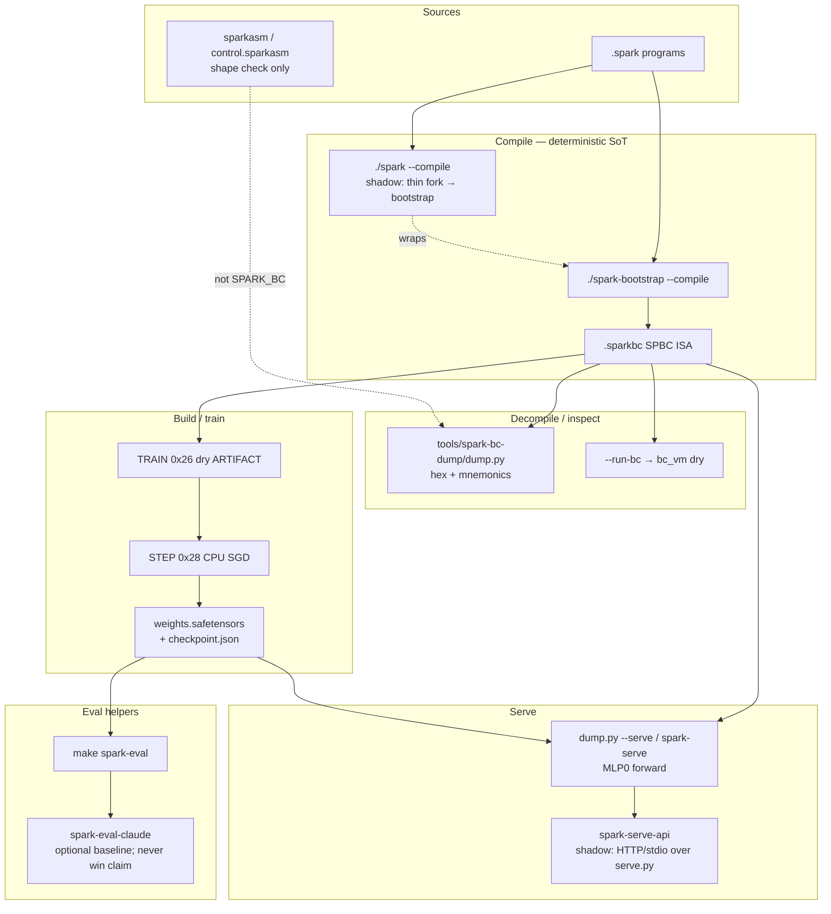
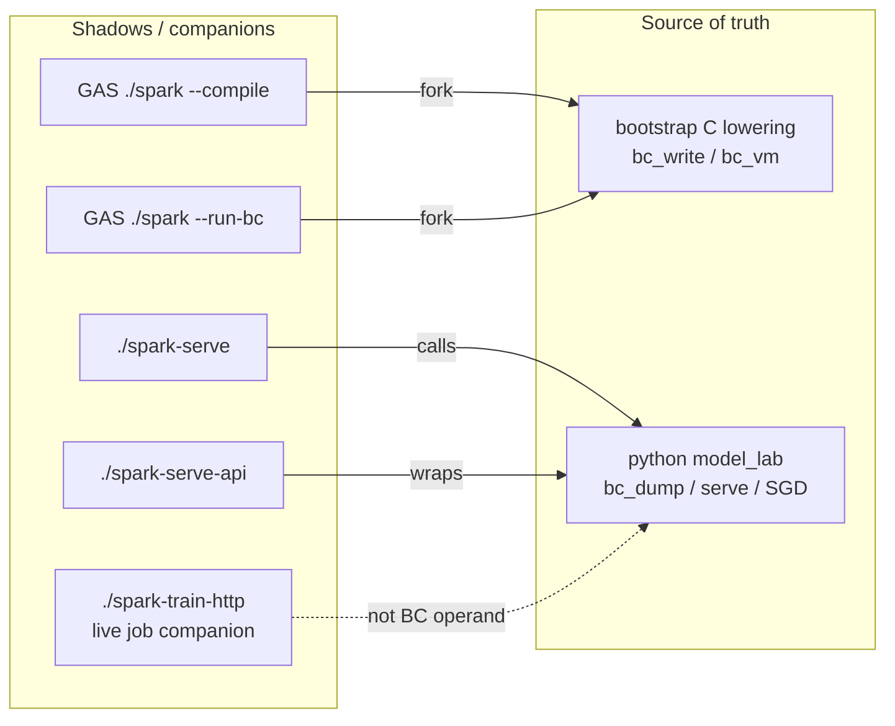
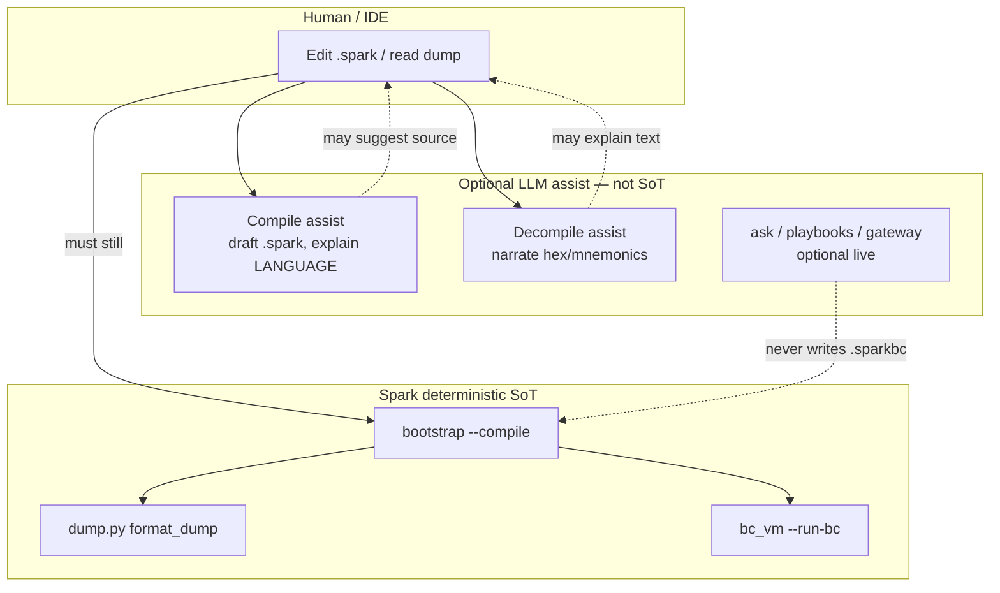

# Factory diagrams — tools + LLM assist

Engineer overview diagrams for the **Spark / SparkLang** SPARK_BC
factory. Deterministic tooling is SoT. LLMs may **assist** authors;
they do **not** replace `--compile`, `dump.py`, or `bc_vm`.
**Never** beat Claude. **Never** 6000 train.

Hub: [FACTORY.md](FACTORY.md). Builder: [SPARK_BUILDER.md](SPARK_BUILDER.md).
Helpers/shadows CLIs: [TOOLS_HELPERS.md](TOOLS_HELPERS.md).
**Model aspects (L):** [MODEL_ASPECTS.md](MODEL_ASPECTS.md) — ears →
brain → voice SVG + behavior/tool loops (does not replace these
factory tool diagrams).

**J-lane (landed + research expand):** decompile how-to with CLI
captures + SVG tool diagrams — [DECOMPILE.md](DECOMPILE.md) /
[/docs/decompile.html](/docs/decompile.html). LLM survey (owner
cites: DecompAI agent vs seq2seq, LLM4Decompile, EmergentMind,
Quarkslab article + RE category) —
[research/LLM_DECOMPILE.md](research/LLM_DECOMPILE.md) /
[/docs/llm-decompile.html](/docs/llm-decompile.html). This file
keeps **Mermaid flow** diagrams; prefer DECOMPILE for screenshots.
LLM remains assist-only; dump/`--run-bc` stay SoT.

## 1) How Spark tools function

End-to-end factory: source → bytecode → inspect → train → serve →
measure. Helpers that **shadow** (thin-wrap) SoT stay labeled.



### Tool roles (same story in words)

| Role | SoT / tool | Shadow / helper |
|------|------------|-----------------|
| Compile | `./spark-bootstrap --compile` | `./spark --compile` forks bootstrap |
| Assemble (peer) | `make sparkasm` / `test-sparkasm-control` | Not SPARK_BC emit |
| Decompile / dump | `tools/spark-bc-dump/dump.py` | Published `*-bc.txt` mirrors |
| Run BC | `./spark-bootstrap --run-bc` | `./spark --run-bc` → bc_vm |
| Train program | opcodes `0x26` / `0x28` / `0x27` | `apply_step.py` helper |
| Serve forward | `serve.py` / `dump.py --serve` | `./spark-serve`, `./spark-serve-api` |
| Eval | `tools/spark-eval/run.py` | Claude baseline optional |

Detail pages: [COMPILE.md](COMPILE.md) · [DECOMPILE.md](DECOMPILE.md) ·
[BUILD_MODELS.md](BUILD_MODELS.md) · [TRAIN_LOOP.md](TRAIN_LOOP.md) ·
[SERVE.md](SERVE.md) · [EVAL.md](EVAL.md) · [SPARKBC_MAKE.md](SPARKBC_MAKE.md).

## 2) Helpers and shadows

“Shadow” here means a **thin wrapper** that must not invent a second
encode/decode path. Exit status and bytes stay owned by the SoT.



Do **not** treat a shadow as a richer ISA. If GAS and bootstrap
disagree, bootstrap wins for `.sparkbc`.

## 3) LLMs in compile vs decompile assist

Spark’s public claim is **deterministic factory tooling**. Optional
LLM lanes (IDE ask, playbooks, gateway `ask`) help humans write or
read — they are **not** the compiler or the dump SoT.



### Honesty table

| Action | Deterministic Spark | LLM assist OK? |
|--------|---------------------|----------------|
| Emit `.sparkbc` bytes | **required** (`--compile`) | May draft `.spark` only |
| Hex / opcode dump | **required** (`dump.py`) | May explain a real dump |
| Invent hex / opcodes | **forbidden** | **forbidden** |
| STEP SGD / loss curve | CPU `apply_sgd_step` | Not a substitute |
| Claim beat Claude | **never** | **never** |
| Train on RTX PRO 6000 | **never** | **never** |

## 4) ASCII fallback (no JS)

```
.spark ──► spark-bootstrap --compile ──► .sparkbc
                ▲
   ./spark --compile (shadow wrap)

.sparkbc ──► dump.py ──► hex/mnemonics
         ──► --run-bc ──► TRAIN/STEP/ARTIFACT
         ──► serve.py ──► SERVE / spark-serve-api

LLM assist ──► helps edit/explain ──✗──► does not replace SoT
```

## Related

- [FACTORY.md](FACTORY.md) · [SPARK_BC.md](SPARK_BC.md)
- [DECOMPILE.md](DECOMPILE.md) (J-lane captures when merged)
- [CI_PAGES.md](CI_PAGES.md)
