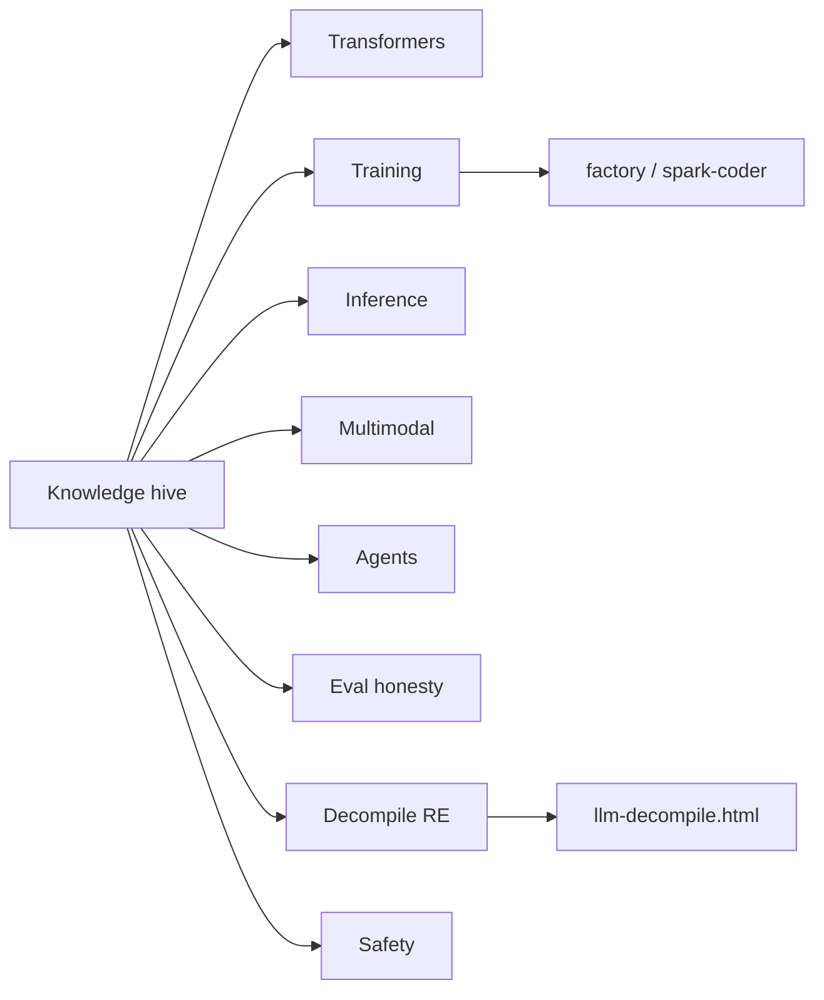

# AI knowledge hive

Engineer-grade **AI concepts** framed for **Spark / SparkLang** —
transformers, training, inference, multimodal, agents, eval honesty,
and decompile limits. Original diagrams (not scraped paper figures).
Citations point at primary papers and surveys.

**Never** claims beat Claude. **Never** RTX PRO 6000. Spark factory
CPU / 5090 paths stay honest. Not an OpenBin clone.

## Topic cards

| Topic | Page | What you get |
|-------|------|--------------|
| LLMs & transformers | [knowledge/LLM_TRANSFORMERS.md](knowledge/LLM_TRANSFORMERS.md) | Tokens → embed → attention → MLP; embeddings |
| Training stack | [knowledge/TRAINING.md](knowledge/TRAINING.md) | Pretrain, SFT, RLHF/RLAIF, LoRA/QLoRA, SGD/Adam |
| Inference | [knowledge/INFERENCE.md](knowledge/INFERENCE.md) | Sampling, KV cache, quantization |
| Multimodal | [knowledge/MULTIMODAL.md](knowledge/MULTIMODAL.md) | STT / TTS / vision |
| Agents & tools | [knowledge/AGENTS_TOOLS.md](knowledge/AGENTS_TOOLS.md) | Tool loops, ReAct-style patterns |
| Eval honesty | [knowledge/EVAL_HONESTY.md](knowledge/EVAL_HONESTY.md) | Benchmarks, baselines, no win theater |
| Decompile + LLM RE | [knowledge/DECOMPILE_RE.md](knowledge/DECOMPILE_RE.md) | Link to existing research; recompile ≠ semantics |
| Safety & limits | [knowledge/SAFETY_LIMITS.md](knowledge/SAFETY_LIMITS.md) | Hallucination, abstain, what Spark won't claim |

## Spark cross-links (factory SoT)

| Surface | Doc |
|---------|-----|
| Factory hub | [FACTORY.md](FACTORY.md) |
| Workflow loop | [/workflow.html](/workflow.html) |
| Voice / STT / TTS | [VOICE.md](VOICE.md) |
| Model aspects | [MODEL_ASPECTS.md](MODEL_ASPECTS.md) |
| Spark coder | [SPARK_CODER.md](SPARK_CODER.md) |
| Train loop | [TRAIN_LOOP.md](TRAIN_LOOP.md) |
| Tokenizer / BPE | [TOKENIZER.md](TOKENIZER.md) |
| Attention honesty | [ATTENTION_FORWARD.md](ATTENTION_FORWARD.md) |
| Eval harness | [EVAL.md](EVAL.md) |
| LLM decompile research | [research/LLM_DECOMPILE.md](research/LLM_DECOMPILE.md) |
| Tutorials | [/learn/](/learn/) |

## How to read this hive

1. Start with **LLMs & transformers** if you need the math sketch.
2. Jump to **Training** / **Inference** for practice vocabulary.
3. Use **Decompile + LLM RE** before trusting pretty recovered C.
4. Prefer Spark factory docs for *what ships*; this hive explains *the field*.

