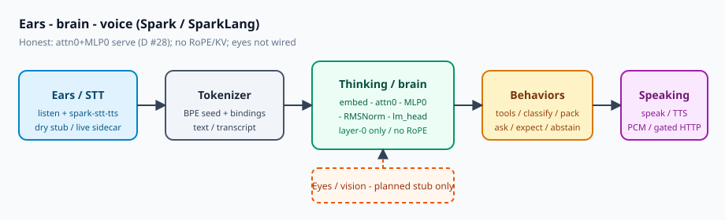
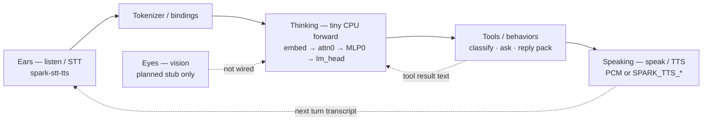
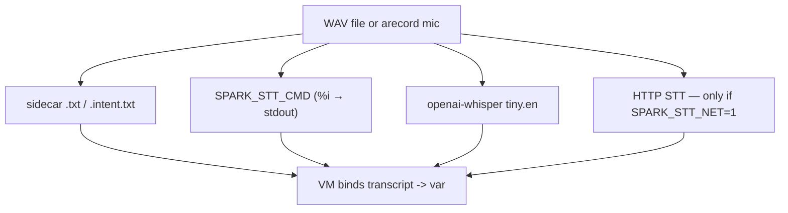
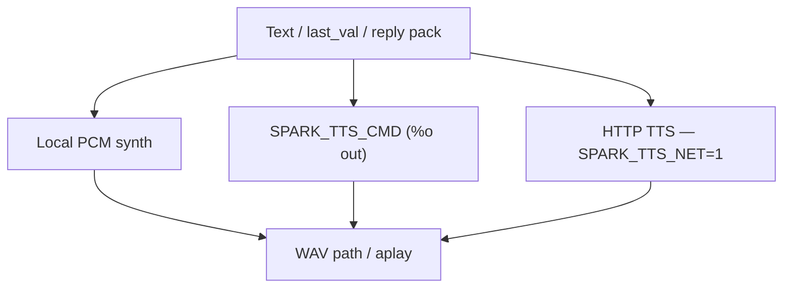
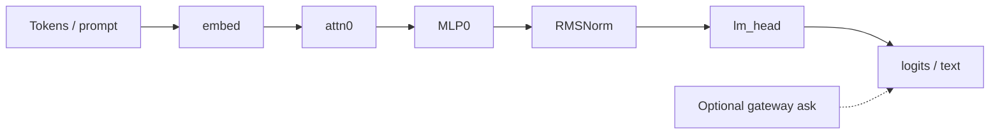
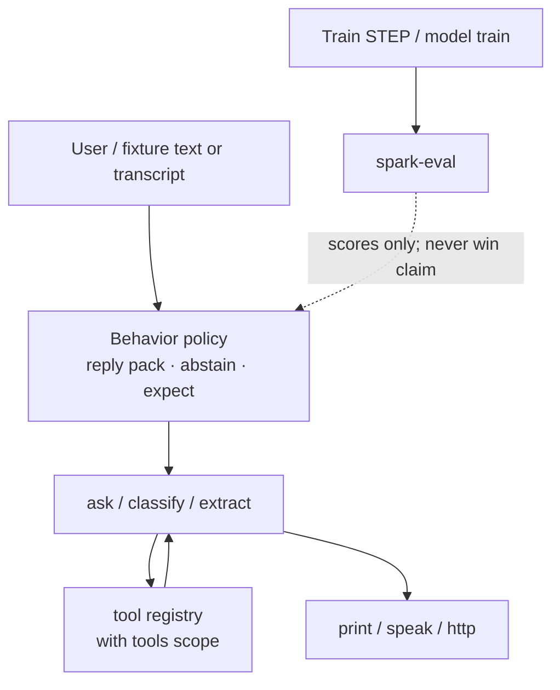

# AI model aspects — sensory mapping for agentic Spark

Engineer map of the **Spark / SparkLang** AI model **as a whole
system**: how text, tools, memory, and optional senses plug into
bytecode + weights + serve. Not marketing. Not God/Loom metaphors.

**Never** claims beat Claude. **Never** trains on the RTX PRO **6000**
(voice-serving GPU elsewhere — not Spark train). Prefer **CPU** or
**RTX 5090** for opt-in large local work.

Factory hub: [FACTORY.md](FACTORY.md). Knowledge hive:
[KNOWLEDGE.md](KNOWLEDGE.md) (agents/tools · multimodal · eval).
Voice surface: [VOICE.md](VOICE.md). Voice easy train:
[VOICE_EASY.md](VOICE_EASY.md). Voice ask (dump Q&A):
[VOICE_ASK.md](VOICE_ASK.md). Methods vs OpenBin:
[METHODS_OPENBIN.md](METHODS_OPENBIN.md). Coder:
[SPARK_CODER.md](SPARK_CODER.md). Weights:
[WEIGHT_GALLERY.md](WEIGHT_GALLERY.md). Architecture:
[ARCHITECTURE.md](ARCHITECTURE.md). Attention honesty:
[ATTENTION_FORWARD.md](ATTENTION_FORWARD.md). Live ask:
[ASK_LIVE.md](ASK_LIVE.md). Diagrams: [DIAGRAMS.md](DIAGRAMS.md).

> **Forge nav:** this page lives under **Forge → Model aspects** on
> [sparklang.dev](https://sparklang.dev/docs/model-aspects.html).
> Sibling Forge entries: Diagrams, Builder, Build models, Train loop,
> Spark coder, Weight gallery, AI models, Voice / STT / TTS.

---

## Category map

| Category | Subcategories (on this page) |
|----------|------------------------------|
| **Senses** | Ears / STT · Eyes / vision · Speaking / TTS |
| **Models** | Thinking / generation · Memory · Status table |
| **Train / ops** | Training & adaptation · Eval & honesty · Runtime / serve |
| **Behaviors** | Behaviors · Tools & actions |

Nav: **Forge → Models → Model aspects** (with Senses / Train siblings).

## Why sensory mapping matters (hero)

Agentic systems are not “a chat box with a bigger context window.”
They are **closed loops**: perceive → decide → act → speak →
perceive again. If you only document the LLM forward pass, you hide
the failure modes that dominate real agents:

| Without a sense map | What goes wrong |
|---------------------|-----------------|
| Ears undefined | STT stubs look “smart” in dry CI; live mic / vendor paths surprise ops |
| Eyes pretended | Screenshots or CDPs get sold as “vision” — they are not |
| Speaking bolted on | TTS latency / net gates / stub WAVs leak into demos as “product voice” |
| Thinking oversold | Fixture-scale MLP0 gets narrated as a frontier model |
| Behaviors implicit | Tools, SoT, abstain, turn policy — the actual agent — stay tribal knowledge |

**Sensory mapping** is the honest contract between *plain language*
(“ears / eyes / speaking / thinking / behaviors”) and *engineering*
(STT sidecar, vision stub, TTS PCM, tiny CPU forward, `.spark`
policies). It is how Spark stays a **local SoT language** instead of
a vague “AI platform” claim.

For agentic AI specifically:

1. **Each sense is a boundary.** Fail-closed net gates
   (`SPARK_STT_NET`, `SPARK_TTS_NET`, inventable-IDK on `ask`) live
   *at* the sense edges — not buried in marketing copy.
2. **Behaviors own the loop.** Tools and reply packs are first-class,
   not afterthoughts bolted onto logits.
3. **Tiny vs large is explicit.** CI stays tiny; large is opt-in on
   **5090** / CPU — never the **6000**.
4. **Comparison without cloning.** OpenBin Ask / production phone
   voice stacks solve different jobs; Spark documents *its* loop and
   refuses to fake theirs.

This page keeps the **summary status table** (below), then expands
~100× into diagrams, how-tos, opcode/CLI maps, gaps, and roadmap.

---

## Sensory mapping (summary table)

| Sense (plain) | Engineering meaning | Spark today |
|---------------|---------------------|-------------|
| **Ears** | STT / audio in | Language `listen` + `./spark-stt-tts` (dry stub / live sidecar) |
| **Eyes** | Vision / image in | **Not in runtime** — thin Python interface stub only |
| **Speaking** | TTS / audio out | Language `speak` + PCM synth / optional HTTP TTS |
| **Thinking** | LLM forward / generation | Tiny CPU `embed→attn0→MLP0→RMSNorm→lm_head` (D #28); fixture-scale |
| **Behaviors** | Policies, tools, turn-taking, safety, train/eval | `.spark` language + reply packs + `tool` / dry ask |

Jump: [Ears](#ears--stt--audio-in) · [Eyes](#eyes--vision--image-in) ·
[Speaking](#speaking--tts--audio-out) ·
[Thinking](#thinking--llm-forward--generation) ·
[Behaviors](#behaviors--policies-tools-turn-taking) ·
[System diagram](#system-diagram--ears--brain--voice--tools) ·
[Comparison](#comparison--spark-local-sot-vs-openbin-ask--phone-voice) ·
[How-to lab](#how-to-lab-15-minutes) ·
[Honesty bar](#honesty-bar-never-fake).

---

## Status table (honest — engineering aspects)

| Aspect | Status | Where / notes |
|--------|--------|---------------|
| Tokenizer (byte BPE seed) | **implemented** | [TOKENIZER.md](TOKENIZER.md); `python/sparklang/tokenize/` |
| Token embed (`spark.embed`) | **implemented** | Init + serve; optional STEP grads |
| Layers / MLP (SwiGLU MLP0) | **implemented** (serve) | [SERVE.md](SERVE.md); MLP0 in forward |
| Attention (QKVO / GQA) | **implemented** (layer-0) | D #28 — last-query MHA train+serve; **no** RoPE |
| RMSNorm / `lm_head` | **implemented** | Serve path after attn0/MLP0 |
| Memory / context window | **partial** | Script bindings + dry fixtures; **no** KV-cache decode |
| Tools / actions | **implemented** (dry) | `tool` / `with tools`; live tool bus **planned** |
| Ears / STT | **implemented** (surface) | Dry stub; live sidecar / whisper / gated HTTP |
| Eyes / vision | **planned** | Stub module only — **no** `look` opcode on tip |
| Speaking / TTS | **implemented** (surface) | Dry WAV marker; live PCM synth / gated HTTP |
| Behaviors / policies | **partial** | `spark_reply_pack`, abstain, expect, `./spark-ground`; no full SM |
| Train / adaptation | **implemented** (CPU/5090) | STEP SGD + owned TinyCoder (M #30) — never 6000 |
| Eval / honesty | **implemented** | `make spark-eval`; optional Claude baseline — **not** beat Claude |
| Runtime serve | **implemented** | `spark-serve` / `spark-serve-api` attn0+MLP0 CPU |
| Multimodal fused I/O | **planned** | Text+voice demos exist; no joint vision+LM tensors |
| Knowledge hive | **implemented** (docs) | [KNOWLEDGE.md](KNOWLEDGE.md) → [/docs/knowledge.html](/docs/knowledge.html); multimodal / agents topic pages |

---

## System diagram — ears → brain → voice ↔ tools






**Loop reading (plain):** ears (or typed text) become tokens → thinking
produces logits / ask text → behaviors pick tools, SoT, or abstain →
speaking (or `print`) leaves the system → the next turn may listen
again. Eyes stay **dashed**: planned contract only.

---

## Ears — STT / audio in


### Plain language

**Ears** turn sound into text the rest of Spark can bind (`->`) and
pipe (`|`). Without ears, agent demos stay keyboard-only.

### Engineering stack

| Layer | Piece |
|-------|-------|
| Language | `listen "file.wav" -> transcript` · bare `listen -> user` (mic) |
| Asm | `asm/voice_ops.s` — `voice_listen_live_dispatch` |
| Companion | `tools/voice/spark_stt_tts.c` → `./spark-stt-tts` |
| Dry path | Stub transcript; no mic; no vendor |
| Live path | RIFF/WAVE → sidecar `.intent.txt` / `.txt`, `SPARK_STT_CMD`, local openai-whisper, or HTTP if gated |
| Mic | `--mic` → `arecord` (S16_LE 16 kHz mono) then same STT path |

### Dataflow



### Opcodes / CLI / makefile today

```bash
make                          # builds spark-stt-tts
./spark --dry-run examples/voice_turn.spark
./spark --live examples/voice_live.spark
./spark-stt-tts status
./spark-stt-tts listen --in examples/fixtures/audio/sample_review.wav
make voice-test               # local companion smoke
```

| Env / flag | Meaning |
|------------|---------|
| `--dry-run` | Stub ears — CI default |
| `--live` | Fork `./spark-stt-tts` |
| `SPARK_STT_NET=1` + `SPARK_STT_URL` | HTTP STT (fail closed without gate) |
| `SPARK_STT_CMD` | Local shell STT (`%i` in) |
| `SPARK_WHISPER_MODEL` | Whisper model id (default `tiny.en`) |
| `SPARK_STT_WHISPER=0` | Disable whisper probe |

### Tiny vs large (5090 OK, never 6000)

| Path | Scale | Device |
|------|-------|--------|
| Dry stub / CI whisper tiny | **tiny** | CPU |
| Live sidecar + local whisper | small local | CPU |
| Opt-in owned voice heads | tiny / **large** via [VOICE_EASY.md](VOICE_EASY.md) (`make voice-easy`) | Prefer **5090**; refuse **6000** |

Large STT heads are **owned experiments**, not a claim of vendor ASR
parity. See [VOICE.md](VOICE.md) tiny-vs-large table.

### Gaps vs roadmap

| Gap | Honesty |
|-----|---------|
| Barge-in / EOU / silence | **Not shipped** as production |
| Streaming partial transcripts into VM | **Not** a product claim |
| Multi-mic / telephony codec matrix | PSTN gated separately — not “ears done” |
| Neural ASR training as default CI | **No** — dry stub is SoT for `make test` |

### Links

[VOICE.md](VOICE.md) · [SPARK_CODER.md](SPARK_CODER.md) (sibling train
discipline) · [WEIGHT_GALLERY.md](WEIGHT_GALLERY.md) ·
[CI_PAGES.md](CI_PAGES.md).

---

## Eyes — vision / image in


### Plain language

**Eyes** would turn images into captions or visual tokens the brain
can use. Spark tip does **not** have working eyes.

### Engineering stack (honest)

| Claim | Reality on tip |
|-------|----------------|
| Vision encoder | **None** |
| Image tokens into `spark.embed` | **None** |
| Language `look` opcode | **None** |
| Browser CDP screenshot | Writes PNG for humans — **not** a vision model |
| Ship today | `python/sparklang/senses/vision.py` — `VisionRequest` / `VisionResult`, `status=planned` |

```bash
make test-senses
python3 -m unittest python/sparklang/senses/test_senses.py
```

### Dataflow (planned — dashed)


### Tiny vs large

N/A for runtime. Do **not** route hypothetical vision train to the
**6000**. Any future large vision experiment follows the same
**5090-or-CPU** discipline as coder / weights.

### Gaps vs roadmap

| Item | Status |
|------|--------|
| `look "path.png" -> caption` | **Planned** — same fail-closed net gates as STT |
| Fused vision+LM tensors | **Planned** multimodal row above |
| “Eyes fully working” marketing | **Forbidden** — this page exists to prevent that lie |

### Links

Senses package under `python/sparklang/senses/` · Factory honesty in
[FACTORY.md](FACTORY.md) · Adoption: [ADOPTION_BAR.md](ADOPTION_BAR.md).

---

## Speaking — TTS / audio out


### Plain language

**Speaking** turns text (or the last bound value) into audio the user
can hear — or a dry WAV marker CI can hash.

### Engineering stack

| Layer | Piece |
|-------|-------|
| Language | `speak "Hello" -> "out.wav"` · `speak reply` · `speak with model NAME` |
| Asm | `voice_speak_live_dispatch` / `voice_speak_model_dispatch` |
| Companion | `./spark-stt-tts speak …` |
| Dry | `write_stub_wav` / tiny WAV marker |
| Live | Built-in PCM synthesizer → 16-bit WAV; or `SPARK_TTS_CMD`; or HTTP if gated; optional `aplay` |

`speak with model NAME` loads a **written** voice model under
`out/voice_models/` (timbre/prosody params) — config / features,
**not** a claim of neural clone training inside Spark.

`spark_reply_pack` can store spoken scripts for `speak reply` on
text-only bases — still **not** voice-GPU / LoRA TTS.

### Dataflow



### Opcodes / CLI / makefile

```bash
./spark --dry-run examples/voice_turn.spark
./spark-stt-tts speak --text "hi" --out /tmp/spark-voice-test.wav
./spark --dry-run examples/voice_copy.spark    # written model path
./spark --dry-run examples/model_train_reply.spark
```

| Gate | Enables |
|------|---------|
| `SPARK_TTS_NET=1` + `SPARK_TTS_URL` | HTTP TTS |
| `SPARK_SPEECH_NET=1` | Both STT + TTS net |
| `SPARK_TTS_PLAY=1` / `--play` | Play after speak |
| URL without gate | **exit 2** — fail closed |

### Tiny vs large (5090 OK, never 6000)

| Path | What it is |
|------|------------|
| Dry stub WAV | CI SoT |
| Live PCM synth | Local, not vendor quality |
| Written voice models | Features under `out/voice_models/` |
| Opt-in owned TTS heads | Prefer **5090**; **never 6000** |

### Gaps vs roadmap

Production telephony gaps (barge-in, call SM, latency budgets) are
documented in [VOICE.md](VOICE.md) — Spark speaking is a
**language/demo surface**, not a call-center product.

### Links

[VOICE.md](VOICE.md) · [MODEL_TRAINING.md](MODEL_TRAINING.md)
(reply pack) · templates under `templates/voice_models/`.

---

## Thinking — LLM forward / generation


### Plain language

**Thinking** is how Spark turns tokens into the next token / ask text
— either the **owned tiny CPU serve path** or an **optional live
gateway** `ask` (not required for dry demos).

### Engineering stack — tiny CPU serve (weights)

When MLP tensors exist ([SERVE.md](SERVE.md)):

```text
embed (mean pool) → attn0 (layer-0 last-query MHA, D #28)
  → MLP0 (SwiGLU) → RMSNorm → lm_head
```

Code: `python/sparklang/model_lab/serve.py`. HTTP/stdio:
`./spark-serve-api` (`/v1/predict`, `/v1/embeddings`).

| Piece | Status |
|-------|--------|
| Embed + lm_head | **yes** |
| MLP0 SwiGLU | **yes** in serve |
| Layer-0 last-query attn (D #28) | **yes** train + serve |
| Multi-layer attn decode | **no** |
| RoPE / KV cache | sparkasm macros / shape check — **not** in Python path |

### Language `ask` / classify / extract

| Mode | Behavior |
|------|----------|
| Dry | Fixtures / heuristics — CI safe |
| Live | `./spark-ask-http` + `AI_GATEWAY_URL` — [ASK_LIVE.md](ASK_LIVE.md) |
| Grounding | Inventable prompts IDK unless `--sot-ok` |

Bifrost is **one optional backend**, not a Spark requirement. Spark
is **not** a Bifrost plugin.

### Dataflow



### CLI / makefile

```bash
make spark-serve
./spark-serve docs/examples/spark-builder.sparkbc /tmp/serve-dry-001

make spark-serve-api
./spark-serve-api --weights …/weights.safetensors --http \
  --host 127.0.0.1 --port 8765

make spark-ask-http
./spark-ask-http --dry --model fixtures/tiny-lm --prompt "Reply: pong"
make test-ask-gateway
```

### Tiny vs large (5090 OK, never 6000)

| Scale | Thinking path |
|-------|---------------|
| **tiny** | Fixture dims; CI SGD; TinyCoder default ([SPARK_CODER.md](SPARK_CODER.md)) |
| **large** | Opt-in `make spark-coder-train-large` / weight gallery large+xl stubs — prefer **5090** |
| **6000** | **Never** for train |

Stub / gallery weights are **not** production LLMs and do **not**
beat Claude. Catalog: [WEIGHT_GALLERY.md](WEIGHT_GALLERY.md).

### Gaps vs roadmap

| Gap | Status |
|-----|--------|
| Multi-layer decode + KV cache | **No** |
| RoPE in Python serve | **No** |
| “Beat Claude” | **Forbidden claim** — eval scores only ([EVAL.md](EVAL.md)) |

### Links

[ATTENTION_FORWARD.md](ATTENTION_FORWARD.md) ·
[ARCHITECTURE.md](ARCHITECTURE.md) · [SERVE.md](SERVE.md) ·
[SPARK_CODER.md](SPARK_CODER.md) · [WEIGHT_GALLERY.md](WEIGHT_GALLERY.md) ·
[ASK_LIVE.md](ASK_LIVE.md).

---

## Behaviors — policies, tools, turn-taking


### Plain language

**Behaviors** are the policies and control flow around the model —
not the tensor math. This is where agentic systems win or fail:
tools, SoT, abstain, expect, reply locking, train/eval feedback.

### What Spark does today

| Behavior | What Spark does today | Limit |
|----------|----------------------|-------|
| Turn scripts | `.spark` statements bind vars (`->`), chain with `\|` | No barge-in / EOU SM |
| Intent routing | `classify` dry fixtures + live ask | Heuristic / gateway — not a trained NLU stack claim |
| Reply locking | `spark_reply_pack` (`replies.json` + `gate.json`) | Overlay scripts on text-only bases; **not** neural TTS |
| Inventable safety | SoT refs or IDK / abstain heads | Fail loud — never fabricate |
| Grounded / anti-guess | `./spark-ground` verify-before-speak | Wrong expect → abstain (exit 2); not “impossible to lie” |
| Tool use | `tool name(…) { stub }` + `with tools […]` | Dry returns `[tool:…] stub:local`; no agentic loop claim |
| Shell escape | `shell` / `run` allowlist dry; live `--allow-shell` | Never `system()` |
| Expect / eval gate | `expect equal` / `contains` | Pass/fail on scripts |
| Receptionist goal | `examples/receptionist_goal.spark` `[goal]` | Sketch — not production telephony |

### Language tools (behaviors)

```
tool weather(city: string) -> string { "stub:local" }
with tools [weather] {
  ask "Weather in DSM?" -> answer
}
```

Dry `ask` inside an active scope returns `[tool:<name>] stub:local`.

**Separate** from factory **helper tools** (I/K): `spark-helper-*`,
shadows, SDK pack — those wrap compile/decompile/serve for authors.
See [DIAGRAMS.md](DIAGRAMS.md) and [TOOLS_HELPERS.md](TOOLS_HELPERS.md).
Model **behaviors** stay in `.spark`; helpers do not silently become
policy.

### Dataflow



### Train / eval (behavior adjacent)

| Path | Status | Honesty |
|------|--------|---------|
| SPARK_BC `TRAIN` / `STEP` | **implemented** | Multi-outer CPU SGD |
| Five HTTP train methods | **implemented** | distill / pref / playbook / FAQ / reply pack — CPU |
| Owned TinyCoder | **implemented** (M #30) | tiny CI + large opt-in — never 6000 |
| LoRA / voice-GPU | **won't (claim)** | Not sold on sparklang.dev |
| `make spark-eval` | **implemented** | Exit 0 = harness ran — **not** beat Claude |

[TRAIN_LOOP.md](TRAIN_LOOP.md) · [BUILD_MODELS.md](BUILD_MODELS.md) ·
[MODEL_TRAINING.md](MODEL_TRAINING.md) · [EVAL.md](EVAL.md).

### Gaps vs roadmap

| Gap | Status |
|-----|--------|
| Full turn state machine | **Partial** — no production SM |
| Live tool bus | **Planned** |
| Helpers ≠ policy | Keep separate forever |

### Links

[LANGUAGE.md](LANGUAGE.md) · [VOICE.md](VOICE.md) ·
[knowledge/SAFETY_LIMITS.md](knowledge/SAFETY_LIMITS.md)
(grounded / anti-guess) ·
[ADOPTION_BAR.md](ADOPTION_BAR.md) · [SPARK_CODER.md](SPARK_CODER.md).

---

## Memory & context (cross-cutting)

| Mechanism | Status | Notes |
|-----------|--------|-------|
| Statement bindings (`->`) | **implemented** | In-script memory for one run |
| Pipeline `\|` chaining | **implemented** | Passes last values |
| Gateway chat history | **external** | Only if the live gateway keeps it — not Spark KV |
| Transformer KV cache | **not** | Layer-0 last-query only; no KV cache |
| RAG `retrieve` / `embed` | **implemented** (dry + live companion) | Project fixtures / `spark-rag-http` |
| Long-term episodic store | **planned** | Not a shipped product claim |

Do not invent a context-window size for production marketing — read
live dims from weights / control asm when measuring.

---

## Comparison — Spark local SoT vs OpenBin Ask / phone voice

Spark is the **local** language + bytecode + weights SoT. Other
products are related reading — **not** clones and **not** substitutes
for Spark recovery / serve proofs.

| Dimension | **Spark (this repo / sparklang.dev)** | **OpenBin Ask** ([openbin.ai](https://openbin.ai/)) | **Production phone voice** (e.g. CallsBack.ai-class) |
|-----------|----------------------------------------|-----------------------------------------------------|------------------------------------------------------|
| Job | Language + SPARK_BC factory + optional senses | Online AI reverse-engineering / agent Q&A on binaries | Live DID telephony, STT/TTS, transfers, digests |
| SoT | Local `dump.py` / `--compile` / `--run-bc` / dry fixtures | Cloud project + Ghidra-backed decompile — **not** SPARK_BC | Carrier + worker journals — **not** Spark VM |
| Ask path | Dry fixtures **or** optional `./spark-ask-http` + gateway ([ASK_LIVE.md](ASK_LIVE.md)); dump/binary Q&A via [VOICE_ASK.md](VOICE_ASK.md) (`./spark-ask` / `./spark-speak-ask`) — not OpenBin SaaS | Agent loop over RE tools / BYOK LLMs | Prompt + tools inside the voice worker |
| Ears / speaking | Language `listen`/`speak` + `spark-stt-tts` (gated) | N/A (RE product) | Always-on production STT/TTS + capacity rules |
| Eyes | **Planned stub only** | Screenshots ≠ Spark vision | Optional vision elsewhere — not claimed here |
| Trust | Binaries stay local; fail-closed net gates | Upload / login trust surface — lab-gated on SoapBox | Staff / divert / recording retention policies |
| GPU | Train: CPU / **5090**; **never 6000** | Vendor / cloud | Voice LLM may use reserved GPUs — **out of Spark train** |
| Honesty | Never beat Claude; never fake eyes | Not Spark decompile SoT | Not a Spark clone — do not reimplement here |

**Do not:**

- Treat OpenBin output as verified Spark recovery
- Clone OpenBin UX into sparklang.dev
- Sell Spark voice as a phone stack
- Route Spark train onto the **6000** because a phone product uses it

Decompile research context (OpenBin cited carefully):
[research/LLM_DECOMPILE.md](research/LLM_DECOMPILE.md) →
[/docs/llm-decompile.html](/docs/llm-decompile.html).


---

## How-to lab (15 minutes)

Prove the sensory map without inventing live vendor calls:

```bash
# 0) Bootstrap
make spark-bootstrap spark

# 1) Ears + speaking dry (CI SoT)
./spark --dry-run examples/voice_turn.spark

# 2) Companion smoke (local PCM / stub listen)
make voice-test

# 3) Eyes honesty gate (planned stub)
make test-senses

# 4) Thinking — tiny serve dry
make spark-serve
./spark-serve docs/examples/spark-builder.sparkbc /tmp/serve-dry-001

# 5) Behaviors — dry tools + expect
./spark --dry-run examples/tool_agent.spark

# 6) Optional live ask — dry companion only
make spark-ask-http
./spark-ask-http --dry --model fixtures/tiny-lm --prompt "pong"

# 7) Docs regen when you edit this file
make docs-check
```

Live STT/TTS/PSTN and live gateway ask need **explicit** gates —
see [VOICE.md](VOICE.md) and [ASK_LIVE.md](ASK_LIVE.md). Prefer
passive / dry proofs when carrier divert or missing keys apply.

---

## Runtime / serve wiring (thinking surface)

```bash
make spark-serve-api
./spark-serve-api --weights …/weights.safetensors --http \
  --host 127.0.0.1 --port 8765
```

Voice companions are **not** inside `serve_api` — ears/speaking fork
`./spark-stt-tts` from the language VM under `--live`. Predict API
stays token-id JSON for the tiny CPU stack.

[SERVE.md](SERVE.md) · [CI_PAGES.md](CI_PAGES.md).

---

## Honesty bar (never fake)

| Claim | Allowed? |
|-------|----------|
| Ears/speaking language surface + dry/live gated companions | **Yes** |
| Eyes fully working / vision encoder shipped | **No** |
| Beat Claude | **No** |
| Train on RTX PRO **6000** | **Never** |
| Opt-in large on **5090** / CPU | **Yes** |
| OpenBin clone / phone-stack clone | **No** |
| Spark local SPARK_BC SoT | **Yes** |

Adoption checklist: [ADOPTION_BAR.md](ADOPTION_BAR.md).
Roadmap sketches: [ROADMAP.md](ROADMAP.md).

---

## Related lanes

| Lane | Relation to this page |
|------|------------------------|
| **H** | Factory hub + diagrams — **extended**, not replaced |
| **J** | Decompile research / OpenBin citations — cross-link; no fight |
| **I / K** | SDK / helpers / shadows — tools for authors; behaviors ≠ helpers |
| **D** | Attention math — layer-0 last-query honest |
| **E / F / G** | Eval / scale / serve API — linked above |
| **M** | Owned spark-coder — tiny + large discipline |
| **L** | This sensory map (expanded) |

---

## Quick links (Forge + Bench)

- [FACTORY.md](FACTORY.md) · [DIAGRAMS.md](DIAGRAMS.md) · [KNOWLEDGE.md](KNOWLEDGE.md)
- [VOICE.md](VOICE.md) · [AI_MODELS.md](AI_MODELS.md) · [ASK_LIVE.md](ASK_LIVE.md)
- [SPARK_CODER.md](SPARK_CODER.md) · [WEIGHT_GALLERY.md](WEIGHT_GALLERY.md)
- [ARCHITECTURE.md](ARCHITECTURE.md) · [TOKENIZER.md](TOKENIZER.md)
- [LANGUAGE.md](LANGUAGE.md) · [ROADMAP.md](ROADMAP.md)
- Site: [/docs/model-aspects.html](/docs/model-aspects.html) ·
  [/docs/knowledge.html](/docs/knowledge.html) ·
  [/docs/voice.html](/docs/voice.html) ·
  [/docs/voice-easy.html](/docs/voice-easy.html) ·
  [/docs/voice-ask.html](/docs/voice-ask.html) ·
  [/docs/methods-openbin.html](/docs/methods-openbin.html) ·
  [/docs/spark-coder.html](/docs/spark-coder.html) ·
  [/docs/weight-gallery.html](/docs/weight-gallery.html)
