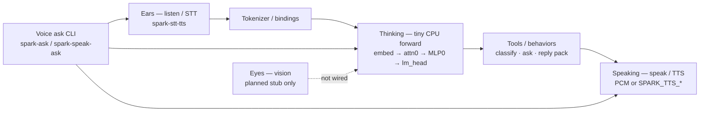
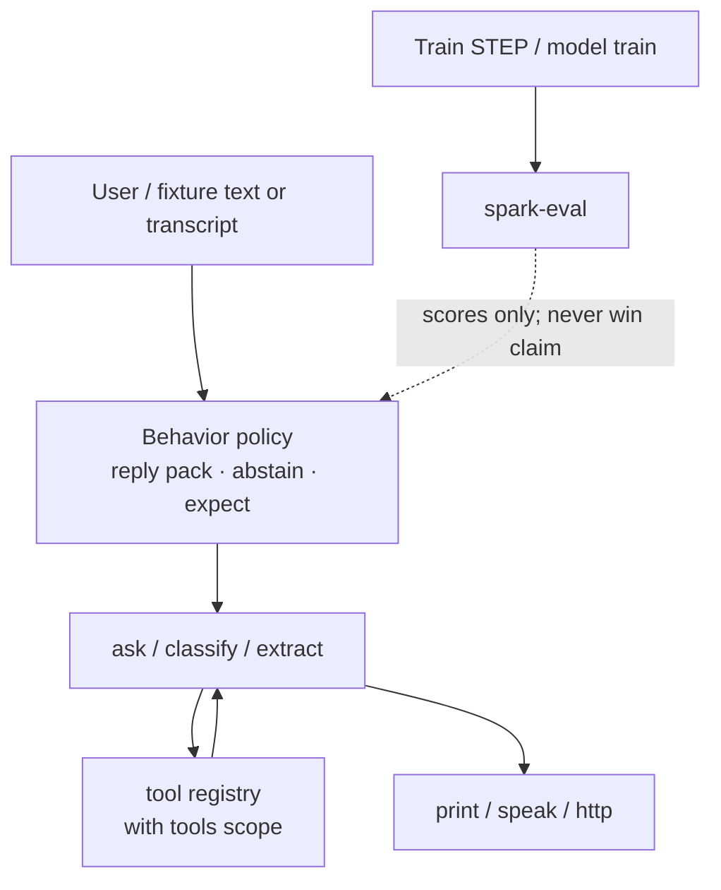
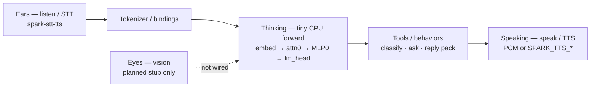

<<<<<<< HEAD
# AI model aspects — behaviors, senses, voice I/O

Engineer map of the **Spark / SparkLang** AI model **as a whole
system**: how text, tools, memory, and optional senses plug into
bytecode + weights + serve. Not marketing. Not God/Loom metaphors.
**Never** claims beat Claude. **Never** trains on the RTX PRO 6000.

Factory hub: [FACTORY.md](FACTORY.md). Companion senses detail:
[VOICE.md](VOICE.md). Architecture tensors:
[ARCHITECTURE.md](ARCHITECTURE.md). Attention honesty:
[ATTENTION_FORWARD.md](ATTENTION_FORWARD.md).

**Sensory mapping (this page):**

| Sense (plain) | Engineering meaning | Spark today |
|---------------|---------------------|-------------|
| **Ears** | STT / audio in | Language `listen` + `./spark-stt-tts` (dry stub / live sidecar) |
| **Eyes** | Vision / image in | **Not in runtime** — thin Python interface stub only |
| **Speaking** | TTS / audio out | Language `speak` + PCM synth / optional HTTP TTS |
| **Thinking** | LLM forward / generation | Tiny CPU `embed→attn0→MLP0→RMSNorm→lm_head` (D #28); fixture-scale |
| **Behaviors** | Policies, tools, turn-taking, safety, train/eval | `.spark` language + reply packs + `tool` / dry ask |

External production voice stacks (other products) are **out of scope**
here — Spark documents its own language surface and companions.

## Status table (honest)

| Aspect | Status | Where / notes |
|--------|--------|---------------|
| Tokenizer (byte BPE seed) | **implemented** | [TOKENIZER.md](TOKENIZER.md); `python/sparklang/tokenize/` |
| Token embed (`spark.embed`) | **implemented** | Init + serve; optional STEP grads |
| Layers / MLP (SwiGLU MLP0) | **implemented** (serve) | [SERVE.md](SERVE.md); MLP0 in forward |
| Attention (QKVO / GQA) | **implemented** (layer-0) | D #28 — last-query MHA train+serve; **no** RoPE |
| RMSNorm / `lm_head` | **implemented** | Serve path after attn0/MLP0 |
| Memory / context window | **partial** | Script bindings + dry fixtures; **no** KV-cache decode |
| Tools / actions | **implemented** (dry) | `tool` / `with tools`; live tool bus **planned** |
| Ears / STT | **implemented** (surface) | Dry stub; live sidecar / whisper / gated HTTP |
| Voice ask loop | **implemented** | `./spark-ask` / `./spark-speak-ask` — dump context + TinyCoder; [VOICE_ASK.md](VOICE_ASK.md) |
| Eyes / vision | **planned** | Stub module only — no `look` opcode on tip |
| Speaking / TTS | **implemented** (surface) | Dry WAV marker; live PCM synth / gated HTTP |
| Behaviors / policies | **partial** | `spark_reply_pack`, abstain heads, expect; no full SM |
| Train / adaptation | **implemented** (CPU/5090) | STEP SGD + owned TinyCoder (M #30) — never 6000 |
| Eval / honesty | **implemented** | `make spark-eval`; optional Claude baseline — **not** beat Claude |
| Runtime serve | **implemented** | `spark-serve` / `spark-serve-api` attn0+MLP0 CPU |
| Multimodal fused I/O | **planned** | Text+voice demos exist; no joint vision+LM tensors |

## Diagram — ears → brain → voice




Dump/binary voice Q&A: [VOICE_ASK.md](VOICE_ASK.md) (no OpenBin login).

## Diagram — behavior + tool loop




## Behaviors (detailed)

**Behaviors** are the policies and control flow around the model —
not the tensor math itself.

| Behavior | What Spark does today | Limit |
|----------|----------------------|-------|
| Turn scripts | `.spark` statements bind vars (`->`), chain with `\|` | No barge-in / EOU SM |
| Intent routing | `classify` dry fixtures + live ask | Heuristic / gateway — not a trained NLU stack claim |
| Reply locking | `spark_reply_pack` (`replies.json` + `gate.json`) | Overlay scripts on text-only bases; **not** neural TTS |
| Inventable safety | SoT refs or IDK / abstain heads | Fail loud — never fabricate |
| Tool use | `tool name(…) { stub }` + `with tools […]` | Dry returns `[tool:…] stub:local`; no agentic loop claim |
| Shell escape | `shell` / `run` allowlist dry; live `--allow-shell` | Never `system()` |
| Expect / eval gate | `expect equal` / `contains` | Pass/fail on scripts |
| Receptionist goal | `examples/receptionist_goal.spark` `[goal]` | Sketch — not production telephony |

Detail: [VOICE.md](VOICE.md) · [MODEL_TRAINING.md](MODEL_TRAINING.md) ·
[LANGUAGE.md](LANGUAGE.md) (`tool` / `with tools`) ·
[ADOPTION_BAR.md](ADOPTION_BAR.md). Helpers/SDK tools (I/K lanes)
shadow compile/decompile/serve — they do **not** replace behavior
policy in `.spark` files. Diagrams of helper shadows:
[DIAGRAMS.md](DIAGRAMS.md).

## Ears / STT

**Ears = speech-to-text / audio in.**

| Mode | Behavior |
|------|----------|
| Dry (`--dry-run` / CI) | Stub transcript; no mic; no vendor |
| Live file | RIFF/WAVE → sidecar `.intent.txt` / `.txt`, `SPARK_STT_CMD`, local openai-whisper, or HTTP if gated |
| Live bare `listen` | `--mic` → `arecord` (S16_LE 16 kHz mono) then same STT path |

Companion: `tools/voice/spark_stt_tts.c` → `./spark-stt-tts`.
Asm: `asm/voice_ops.s`. Language: `listen "file.wav" -> transcript`.

Network STT is **OFF** unless `SPARK_STT_NET=1` or
`SPARK_SPEECH_NET=1` + `SPARK_STT_URL`. Fail closed (exit 2) if URL
set without gate.

Full surface + PSTN gates: [VOICE.md](VOICE.md).

## Eyes / vision

**Eyes = image / vision in.**

**Honest:** Spark tip has **no** vision encoder, no image token
path into `spark.embed`, and **no** language `look` opcode.
Browser CDP screenshots (`browser cdp screenshot`) write PNG files
for humans/automation — that is **not** a vision model.

**Ship today:** thin interface stub
`python/sparklang/senses/vision.py` documenting the planned contract
(`VisionRequest` / `VisionResult`, status=`planned`). Gate:
`make test-senses` / `python3 -m unittest
python/sparklang/senses/test_senses.py`.

**Planned (not claimed):** optional `look "path.png" -> caption`
language op + companion that stays dry by default — same fail-closed
net gates as STT. Until that lands, treat eyes as **external /
roadmap**.

## Speaking / TTS

**Speaking = text-to-speech / audio out.**

| Mode | Behavior |
|------|----------|
| Dry | `write_stub_wav` / tiny WAV marker for `speak … -> "path"` |
| Live | Built-in PCM synthesizer → 16-bit WAV; or `SPARK_TTS_CMD`; or HTTP if gated; optional `aplay` |

`speak with model NAME` loads a **written** voice model under
`out/voice_models/` (timbre/prosody params) — config / features,
**not** a claim of neural clone training inside Spark.

`spark_reply_pack` can store spoken scripts for `speak reply` on
text-only bases — still **not** voice-GPU / LoRA TTS.

Net TTS: `SPARK_TTS_NET=1` or `SPARK_SPEECH_NET=1` + `SPARK_TTS_URL`.

## Thinking / generation (LLM forward)

**Thinking = neural (or heuristic) generation path.**

### Tiny CPU serve (weights)

Implemented path when MLP tensors exist:

`embed_mean_pool -> mlp0 -> rms_norm -> lm_head`

Code: `python/sparklang/model_lab/serve.py`. HTTP/stdio:
`./spark-serve-api` (`/v1/predict`, `/v1/embeddings`).

| Piece | Status |
|-------|--------|
| Embed + lm_head | **yes** |
| MLP0 SwiGLU | **yes** in serve |
| Layer-0 last-query attn (D #28) | **yes** train + serve |
| Multi-layer attn decode | **no** |
| RoPE / KV cache | sparkasm macros / shape check — **not** in Python path |

### Language `ask` / classify / extract

Dry: fixtures / heuristics. Live: optional OpenAI-compatible gateway
(`./spark-ask-http`) — Bifrost is one optional backend, **not** a
Spark requirement. See [AI_MODELS.md](AI_MODELS.md).

Cross-link: [ATTENTION_FORWARD.md](ATTENTION_FORWARD.md) ·
[ARCHITECTURE.md](ARCHITECTURE.md) · [SERVE.md](SERVE.md).

## Memory & context

| Mechanism | Status | Notes |
|-----------|--------|-------|
| Statement bindings (`->`) | **implemented** | In-script memory for one run |
| Pipeline `|` chaining | **implemented** | Passes last values |
| Gateway chat history | **external** | Only if the live gateway keeps it — not Spark KV |
| Transformer KV cache | **not** | Layer-0 last-query only; no KV cache |
| RAG `retrieve` / `embed` | **implemented** (dry + live companion) | Project fixtures / `spark-rag-http` |
| Long-term episodic store | **planned** | Not a shipped product claim |

Do not invent a context-window size for production marketing — read
live dims from weights / control asm when measuring.

## Tools & actions

Language tools (behaviors):

```
tool weather(city: string) -> string { "stub:local" }
with tools [weather] {
  ask "Weather in DSM?" -> answer
}
```

Dry `ask` inside an active scope returns `[tool:<name>] stub:local`.

**Separate** from factory **helper tools** (I/K): `spark-helper-*`,
shadows, SDK pack — those wrap compile/decompile/serve for authors.
See [DIAGRAMS.md](DIAGRAMS.md) and (when present)
`docs/TOOLS_HELPERS.md` / SDK pack README. Model **behaviors** stay
in `.spark`; helpers do not silently become policy.

Also actions: `http get`/`post`, `shell`/`run` (gated), `implement`,
`browser …` (de-emphasized). None of these are multimodal vision.

## Training & adaptation

| Path | Status | Honesty |
|------|--------|---------|
| SPARK_BC `TRAIN` / `STEP` | **implemented** | Multi-outer CPU SGD; `trained=true` when grads apply |
| Init weights from BC | **implemented** | Xavier from SPARK_BC bytes |
| Five HTTP train methods | **implemented** | distill / pref / playbook / FAQ / reply pack — CPU |
| LoRA / voice-GPU | **won't (claim)** | Not sold on sparklang.dev |
| Attention train math | **implemented** (D #28) | layer-0 last-query MHA; see [ATTENTION_FORWARD.md](ATTENTION_FORWARD.md) |

[TRAIN_LOOP.md](TRAIN_LOOP.md) · [BUILD_MODELS.md](BUILD_MODELS.md) ·
[MODEL_TRAINING.md](MODEL_TRAINING.md) · [SPARK_BUILDER.md](SPARK_BUILDER.md).

## Eval & honesty (not beat Claude)

`make spark-eval` runs frozen probes. Exit 0 = harness ran.
Optional Claude API baseline (`make spark-eval-claude`) is
**measurement only** — docs and CI **never** claim beat Claude.

[EVAL.md](EVAL.md). Adoption checklist: [ADOPTION_BAR.md](ADOPTION_BAR.md).

## Runtime / serve wiring

```bash
make spark-serve
./spark-serve docs/examples/spark-builder.sparkbc /tmp/serve-dry-001

make spark-serve-api
./spark-serve-api --weights …/weights.safetensors --http \
  --host 127.0.0.1 --port 8765
```

Voice companions are **not** inside `serve_api` — ears/speaking fork
`./spark-stt-tts` from the language VM under `--live`. Predict API
stays token-id JSON for the tiny CPU stack.

[SERVE.md](SERVE.md) · [CI_PAGES.md](CI_PAGES.md).

## Related lanes

| Lane | Relation to this page |
|------|------------------------|
| **H** | Factory hub + diagrams — **extended**, not replaced |
| **J** | Decompile research captures — cross-link when merged; no fight |
| **I / K** | SDK / helpers / shadows — tools for authors; link behaviors ≠ helpers |
| **D** | Attention math — stay honest: partial until merged |
| **E / F / G** | Eval / scale / serve API — linked above |

## Quick links

- [FACTORY.md](FACTORY.md) · [DIAGRAMS.md](DIAGRAMS.md)
- [VOICE.md](VOICE.md) · [AI_MODELS.md](AI_MODELS.md)
- [ARCHITECTURE.md](ARCHITECTURE.md) · [TOKENIZER.md](TOKENIZER.md)
- [LANGUAGE.md](LANGUAGE.md) · [ROADMAP.md](ROADMAP.md)
=======
# AI model aspects — behaviors, senses, voice I/O

Engineer map of the **Spark / SparkLang** AI model **as a whole
system**: how text, tools, memory, and optional senses plug into
bytecode + weights + serve. Not marketing. Not God/Loom metaphors.
**Never** claims beat Claude. **Never** trains on the RTX PRO 6000.

Factory hub: [FACTORY.md](FACTORY.md). Companion senses detail:
[VOICE.md](VOICE.md). Architecture tensors:
[ARCHITECTURE.md](ARCHITECTURE.md). Attention honesty:
[ATTENTION_FORWARD.md](ATTENTION_FORWARD.md).

**Sensory mapping (this page):**

| Sense (plain) | Engineering meaning | Spark today |
|---------------|---------------------|-------------|
| **Ears** | STT / audio in | Language `listen` + `./spark-stt-tts` (dry stub / live sidecar) |
| **Eyes** | Vision / image in | **Not in runtime** — thin Python interface stub only |
| **Speaking** | TTS / audio out | Language `speak` + PCM synth / optional HTTP TTS |
| **Thinking** | LLM forward / generation | Tiny CPU `embed→attn0→MLP0→RMSNorm→lm_head` (D #28); fixture-scale |
| **Behaviors** | Policies, tools, turn-taking, safety, train/eval | `.spark` language + reply packs + `tool` / dry ask |

External production voice stacks (other products) are **out of scope**
here — Spark documents its own language surface and companions.

## Status table (honest)

| Aspect | Status | Where / notes |
|--------|--------|---------------|
| Tokenizer (byte BPE seed) | **implemented** | [TOKENIZER.md](TOKENIZER.md); `python/sparklang/tokenize/` |
| Token embed (`spark.embed`) | **implemented** | Init + serve; optional STEP grads |
| Layers / MLP (SwiGLU MLP0) | **implemented** (serve) | [SERVE.md](SERVE.md); MLP0 in forward |
| Attention (QKVO / GQA) | **implemented** (layer-0) | D #28 — last-query MHA train+serve; **no** RoPE |
| RMSNorm / `lm_head` | **implemented** | Serve path after attn0/MLP0 |
| Memory / context window | **partial** | Script bindings + dry fixtures; **no** KV-cache decode |
| Tools / actions | **implemented** (dry) | `tool` / `with tools`; live tool bus **planned** |
| Ears / STT | **implemented** (surface) | Dry stub; live sidecar / whisper / gated HTTP |
| Voice easy train | **implemented** | `make voice-easy` — owned tiny/large heads; never 6000 |
| Eyes / vision | **planned** | Stub module only — no `look` opcode on tip |
| Speaking / TTS | **implemented** (surface) | Dry WAV marker; live PCM synth / gated HTTP |
| Behaviors / policies | **partial** | `spark_reply_pack`, abstain heads, expect; no full SM |
| Train / adaptation | **implemented** (CPU/5090) | STEP SGD + owned TinyCoder (M #30) — never 6000 |
| Eval / honesty | **implemented** | `make spark-eval`; optional Claude baseline — **not** beat Claude |
| Runtime serve | **implemented** | `spark-serve` / `spark-serve-api` attn0+MLP0 CPU |
| Multimodal fused I/O | **planned** | Text+voice demos exist; no joint vision+LM tensors |

## Diagram — ears → brain → voice




## Diagram — behavior + tool loop


## Behaviors (detailed)

**Behaviors** are the policies and control flow around the model —
not the tensor math itself.

| Behavior | What Spark does today | Limit |
|----------|----------------------|-------|
| Turn scripts | `.spark` statements bind vars (`->`), chain with `\|` | No barge-in / EOU SM |
| Intent routing | `classify` dry fixtures + live ask | Heuristic / gateway — not a trained NLU stack claim |
| Reply locking | `spark_reply_pack` (`replies.json` + `gate.json`) | Overlay scripts on text-only bases; **not** neural TTS |
| Inventable safety | SoT refs or IDK / abstain heads | Fail loud — never fabricate |
| Tool use | `tool name(…) { stub }` + `with tools […]` | Dry returns `[tool:…] stub:local`; no agentic loop claim |
| Shell escape | `shell` / `run` allowlist dry; live `--allow-shell` | Never `system()` |
| Expect / eval gate | `expect equal` / `contains` | Pass/fail on scripts |
| Receptionist goal | `examples/receptionist_goal.spark` `[goal]` | Sketch — not production telephony |

Detail: [VOICE.md](VOICE.md) · [MODEL_TRAINING.md](MODEL_TRAINING.md) ·
[LANGUAGE.md](LANGUAGE.md) (`tool` / `with tools`) ·
[ADOPTION_BAR.md](ADOPTION_BAR.md). Helpers/SDK tools (I/K lanes)
shadow compile/decompile/serve — they do **not** replace behavior
policy in `.spark` files. Diagrams of helper shadows:
[DIAGRAMS.md](DIAGRAMS.md).

## Ears / STT

**Ears = speech-to-text / audio in.**

| Mode | Behavior |
|------|----------|
| Dry (`--dry-run` / CI) | Stub transcript; no mic; no vendor |
| Live file | RIFF/WAVE → sidecar `.intent.txt` / `.txt`, `SPARK_STT_CMD`, local openai-whisper, or HTTP if gated |
| Live bare `listen` | `--mic` → `arecord` (S16_LE 16 kHz mono) then same STT path |

Companion: `tools/voice/spark_stt_tts.c` → `./spark-stt-tts`.
Asm: `asm/voice_ops.s`. Language: `listen "file.wav" -> transcript`.

**Train path (piece of cake):** [VOICE_EASY.md](VOICE_EASY.md) —
`make voice-easy` / `./spark-voice easy` trains **owned** STT/TTS
heads (tiny CI or `--scale large`). Prefer 5090; never 6000. Not a
vendor clone.

Network STT is **OFF** unless `SPARK_STT_NET=1` or
`SPARK_SPEECH_NET=1` + `SPARK_STT_URL`. Fail closed (exit 2) if URL
set without gate.

Full surface + PSTN gates: [VOICE.md](VOICE.md).

## Eyes / vision

**Eyes = image / vision in.**

**Honest:** Spark tip has **no** vision encoder, no image token
path into `spark.embed`, and **no** language `look` opcode.
Browser CDP screenshots (`browser cdp screenshot`) write PNG files
for humans/automation — that is **not** a vision model.

**Ship today:** thin interface stub
`python/sparklang/senses/vision.py` documenting the planned contract
(`VisionRequest` / `VisionResult`, status=`planned`). Gate:
`make test-senses` / `python3 -m unittest
python/sparklang/senses/test_senses.py`.

**Planned (not claimed):** optional `look "path.png" -> caption`
language op + companion that stays dry by default — same fail-closed
net gates as STT. Until that lands, treat eyes as **external /
roadmap**.

## Speaking / TTS

**Speaking = text-to-speech / audio out.**

| Mode | Behavior |
|------|----------|
| Dry | `write_stub_wav` / tiny WAV marker for `speak … -> "path"` |
| Live | Built-in PCM synthesizer → 16-bit WAV; or `SPARK_TTS_CMD`; or HTTP if gated; optional `aplay` |

`speak with model NAME` loads a **written** voice model under
`out/voice_models/` (timbre/prosody params) — config / features,
**not** a claim of neural clone training inside Spark.

`spark_reply_pack` can store spoken scripts for `speak reply` on
text-only bases — still **not** voice-GPU / LoRA TTS.

Net TTS: `SPARK_TTS_NET=1` or `SPARK_SPEECH_NET=1` + `SPARK_TTS_URL`.

## Thinking / generation (LLM forward)

**Thinking = neural (or heuristic) generation path.**

### Tiny CPU serve (weights)

Implemented path when MLP tensors exist:

`embed_mean_pool -> mlp0 -> rms_norm -> lm_head`

Code: `python/sparklang/model_lab/serve.py`. HTTP/stdio:
`./spark-serve-api` (`/v1/predict`, `/v1/embeddings`).

| Piece | Status |
|-------|--------|
| Embed + lm_head | **yes** |
| MLP0 SwiGLU | **yes** in serve |
| Layer-0 last-query attn (D #28) | **yes** train + serve |
| Multi-layer attn decode | **no** |
| RoPE / KV cache | sparkasm macros / shape check — **not** in Python path |

### Language `ask` / classify / extract

Dry: fixtures / heuristics. Live: optional OpenAI-compatible gateway
(`./spark-ask-http`) — Bifrost is one optional backend, **not** a
Spark requirement. See [AI_MODELS.md](AI_MODELS.md).

Cross-link: [ATTENTION_FORWARD.md](ATTENTION_FORWARD.md) ·
[ARCHITECTURE.md](ARCHITECTURE.md) · [SERVE.md](SERVE.md).

## Memory & context

| Mechanism | Status | Notes |
|-----------|--------|-------|
| Statement bindings (`->`) | **implemented** | In-script memory for one run |
| Pipeline `|` chaining | **implemented** | Passes last values |
| Gateway chat history | **external** | Only if the live gateway keeps it — not Spark KV |
| Transformer KV cache | **not** | Layer-0 last-query only; no KV cache |
| RAG `retrieve` / `embed` | **implemented** (dry + live companion) | Project fixtures / `spark-rag-http` |
| Long-term episodic store | **planned** | Not a shipped product claim |

Do not invent a context-window size for production marketing — read
live dims from weights / control asm when measuring.

## Tools & actions

Language tools (behaviors):

```
tool weather(city: string) -> string { "stub:local" }
with tools [weather] {
  ask "Weather in DSM?" -> answer
}
```

Dry `ask` inside an active scope returns `[tool:<name>] stub:local`.

**Separate** from factory **helper tools** (I/K): `spark-helper-*`,
shadows, SDK pack — those wrap compile/decompile/serve for authors.
See [DIAGRAMS.md](DIAGRAMS.md) and (when present)
`docs/TOOLS_HELPERS.md` / SDK pack README. Model **behaviors** stay
in `.spark`; helpers do not silently become policy.

Also actions: `http get`/`post`, `shell`/`run` (gated), `implement`,
`browser …` (de-emphasized). None of these are multimodal vision.

## Training & adaptation

| Path | Status | Honesty |
|------|--------|---------|
| SPARK_BC `TRAIN` / `STEP` | **implemented** | Multi-outer CPU SGD; `trained=true` when grads apply |
| Init weights from BC | **implemented** | Xavier from SPARK_BC bytes |
| Five HTTP train methods | **implemented** | distill / pref / playbook / FAQ / reply pack — CPU |
| LoRA / voice-GPU | **won't (claim)** | Not sold on sparklang.dev |
| Attention train math | **implemented** (D #28) | layer-0 last-query MHA; see [ATTENTION_FORWARD.md](ATTENTION_FORWARD.md) |

[TRAIN_LOOP.md](TRAIN_LOOP.md) · [BUILD_MODELS.md](BUILD_MODELS.md) ·
[MODEL_TRAINING.md](MODEL_TRAINING.md) · [SPARK_BUILDER.md](SPARK_BUILDER.md).

## Eval & honesty (not beat Claude)

`make spark-eval` runs frozen probes. Exit 0 = harness ran.
Optional Claude API baseline (`make spark-eval-claude`) is
**measurement only** — docs and CI **never** claim beat Claude.

[EVAL.md](EVAL.md). Adoption checklist: [ADOPTION_BAR.md](ADOPTION_BAR.md).

## Runtime / serve wiring

```bash
make spark-serve
./spark-serve docs/examples/spark-builder.sparkbc /tmp/serve-dry-001

make spark-serve-api
./spark-serve-api --weights …/weights.safetensors --http \
  --host 127.0.0.1 --port 8765
```

Voice companions are **not** inside `serve_api` — ears/speaking fork
`./spark-stt-tts` from the language VM under `--live`. Predict API
stays token-id JSON for the tiny CPU stack.

[SERVE.md](SERVE.md) · [CI_PAGES.md](CI_PAGES.md).

## Related lanes

| Lane | Relation to this page |
|------|------------------------|
| **H** | Factory hub + diagrams — **extended**, not replaced |
| **J** | Decompile research captures — cross-link when merged; no fight |
| **I / K** | SDK / helpers / shadows — tools for authors; link behaviors ≠ helpers |
| **D** | Attention math — stay honest: partial until merged |
| **E / F / G** | Eval / scale / serve API — linked above |

## Quick links

- [FACTORY.md](FACTORY.md) · [DIAGRAMS.md](DIAGRAMS.md)
- [VOICE.md](VOICE.md) · [AI_MODELS.md](AI_MODELS.md)
- [ARCHITECTURE.md](ARCHITECTURE.md) · [TOKENIZER.md](TOKENIZER.md)
- [LANGUAGE.md](LANGUAGE.md) · [ROADMAP.md](ROADMAP.md)
>>>>>>> 54714fa (feat(voice): easy train path for owned STT/TTS (tiny + large))
