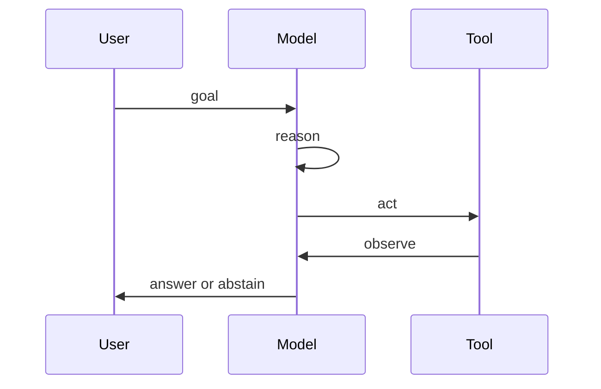

# Agents and tools

An **agent** is a model loop that can **call tools** (APIs, shell,
retrievers, browsers), observe results, and continue until it stops
or abstains. Classic framing: **ReAct** (reason + act)
([Yao et al., 2022](https://arxiv.org/abs/2210.03629)).

## Why tools

Pure next-token prediction invents facts. Tools ground actions:

- search / retrieve
- code execution
- calendars, tickets, payment APIs (dangerous — gate hard)
- compile / dump / expect in a Spark world

## Failure modes (engineer checklist)

| Failure | Mitigation |
|---------|------------|
| Invented tool names/args | Strict schemas; validate |
| Infinite loops | Step budgets; circuit breakers |
| Unsafe side effects | Dry-run; allowlists; human gate |
| Prompt injection via tool output | Treat tool text as untrusted |
| “Looks done” without evidence | Expect / tests / journals |

## Spark surface

- Language: `with tools [&]` — see programming guide / function catalog.
- Behavior + tool loop diagram:
  `docs/images/diagram-behavior-tool-loop.svg`
- Model aspects tools row — [MODEL_ASPECTS.md](MODEL_ASPECTS.md)
- Dry tools return `stub:local` until live gated.

Spark does **not** claim autonomous ops on production store systems
from this hive page — factory + product gates still apply.

Next: [Eval honesty](EVAL_HONESTY.md) · [Safety](SAFETY_LIMITS.md) ·
[Factory](FACTORY.md).
