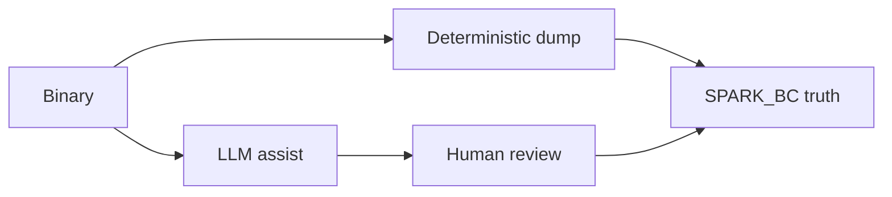

# Decompilation and LLM reverse engineering

Spark already ships a deep research page — **this card does not replace
it**. It orients the knowledge hive and stresses one lesson: **recompile
success is not semantic fidelity**.

## Read first (canonical)

- **LLM decompile research (keep intact):**
  [research/LLM_DECOMPILE.md](research/LLM_DECOMPILE.md) →
  [/docs/llm-decompile.html](/docs/llm-decompile.html)
- **Deterministic dump / inspect:**
  [DECOMPILE.md](DECOMPILE.md) →
  [/docs/decompile.html](/docs/decompile.html)
- **Diagrams:** [DIAGRAMS.md](DIAGRAMS.md)

## Core lesson

[When LLM Decompilers Recompile More and Preserve Less
(arXiv:2609.05370)](https://arxiv.org/abs/2609.05370) shows candidates
that pass shipped tests can still **diverge** under fuzz / broader
inputs; vulnerabilities can vanish from “clean” recompiled code.

Traditional tools leave unknowns **visible**. LLMs may invent types,
fields, and guards that look professional.

## Spark stance

| Layer | Role |
|-------|------|
| `dump.py` / `--compile` / `--run-bc` | **SoT** |
| LLM assist | Author aid only |
| OpenBin / commercial RE | Third-party reading — **not** Spark SoT |
| Beat Claude / perfect decompile | **Never claimed** |

Not an OpenBin UX clone. Continue on the research page for Quarkslab,
LLM4Decompile, DecompileBench, HELIOS, AutoDecompiler, and friends.

Hive: [KNOWLEDGE.md](KNOWLEDGE.md) · Factory: [FACTORY.md](FACTORY.md).
