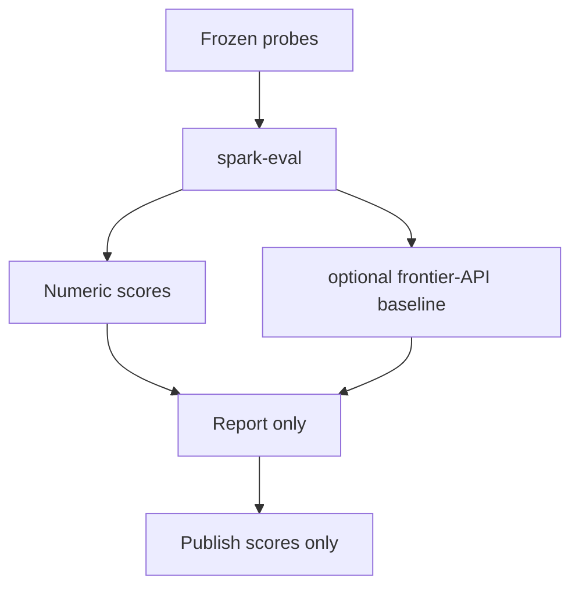

# Evaluation and benchmarks
Scores are **instruments**. Spark’s frozen harness
records probes and optional frontier-API baselines as measurements. ([Eval](EVAL.md)).

## What benchmarks measure

| Family | Examples | Watch-outs |
|--------|----------|------------|
| Knowledge / MMLU-like | Multi-task exams | Contaminated train data |
| Coding | HumanEval, MBPP | Overfit to unit tests |
| Chat preference | Arena-style Elo | Style bias; judge models |
| Tool / agent | Custom trajectories | Env nondeterminism |
| Decompile | Re-exec, recompile | Pretty ≠ correct |

QLoRA authors noted chatbot benchmarks can mislead
([Dettmers et al.](https://arxiv.org/abs/2305.14314)). Prefer
**paired** comparisons on **frozen** prompts with disclosed judges.

## Eval rules (Spark)
1. Publish the **probe set** and git SHA.
2. Separate **fixture dry-run** from live gateway calls.
3. Optional frontier baseline = **reference** score.
4. Abstain / expect failures are first-class — not hidden.

## Related

- [Eval](EVAL.md) — harness
- [ABSTAIN_HEADS.md](ABSTAIN_HEADS.md) — when not to answer
- Decompile metrics skepticism — [DECOMPILE_RE.md](DECOMPILE_RE.md)

Hive home: [Knowledge](KNOWLEDGE.md).
