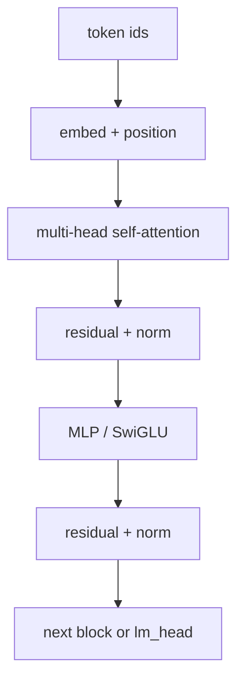

# LLMs, transformers, attention, embeddings

What a **large language model** is doing under the hood — engineer
sketch for Spark readers. Spark’s owned TinyCoder and SPARK_BC
attention path are **tiny and honest**; they do not pretend to be
frontier LLMs and **do not beat Claude**.

## Tokenization

Text is not fed as characters forever. A **tokenizer** maps strings
to integer **token ids** from a finite vocabulary (often 32k–200k).

- **BPE** (byte-pair encoding) merges frequent byte/char pairs
  ([Sennrich et al.](https://arxiv.org/abs/1508.07909)).
- **WordPiece** / Unigram variants appear in BERT-family stacks.
- Spark’s from-nothing path: [TOKENIZER.md](TOKENIZER.md)
  (byte-level BPE seed vocab).

Token boundaries affect everything downstream: cost, context length,
and weird splits on code identifiers.

## Embeddings

Each token id indexes a learned vector (the **embedding**). Modern
distributed word vectors (e.g.
[Word2Vec](https://arxiv.org/abs/1301.3781), Mikolov et al.) set the
pattern; today’s LLMs learn token (and often position) embeddings
jointly with the stack. Similarity in vector space ≈ related meaning
*on average* — not a proof of truth.

Retrieval / RAG stacks embed *chunks* the same way and nearest-neighbor
search them. Spark `embed` / `retrieve` language surface is the
product hook; see [AI_MODELS.md](AI_MODELS.md).

## Transformers & attention

The modern-era **Transformer**
([Vaswani et al. — Attention Is All You
Need](https://proceedings.neurips.cc/paper_files/paper/2017/file/3f5ee243547dee91fbd053c1c4a845aa-Paper.pdf))
replaces recurrence with **self-attention**. Scaled dot-product:

`Attention(Q, K, V) = softmax(Q K^T / sqrt(d_k)) V`

Readable walkthrough: [The Annotated Transformer](https://nlp.seas.harvard.edu/annotated-transformer/)
(Harvard NLP).

**Multi-head attention** runs several QKV projections in parallel so
the model can mix different subspaces. Decoder-only LLMs (GPT-style)
use **causal masks** so position *t* cannot see future tokens.

## Spark honesty map

| Claim | Spark status |
|-------|--------------|
| Layer-0 last-query MHA train/serve | Yes (D-lane) — [ATTENTION_FORWARD.md](ATTENTION_FORWARD.md) |
| Full RoPE / multi-layer production decode | No |
| Beat Claude | **Never** |
| Train on RTX PRO 6000 | **Never** (voice-only elsewhere) |

Continue: [Training stack](TRAINING.md) · [Inference](INFERENCE.md) ·
[Architecture](ARCHITECTURE.md) · [Factory](FACTORY.md).
