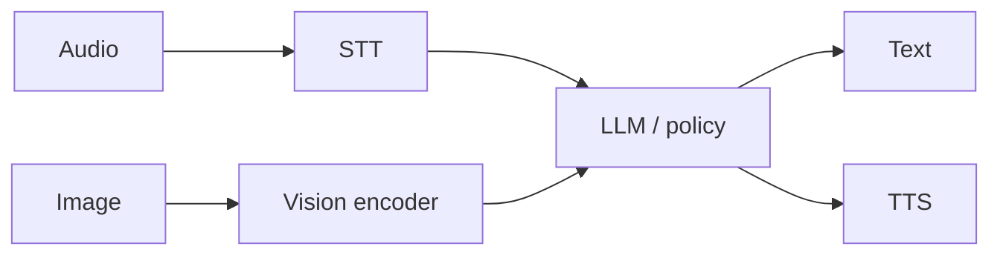

# Multimodal — STT, TTS, vision

Language models eat **tokens**. Multimodal systems add encoders that
map audio or images into that shared space (or into tool side-channels).

## Speech → text (STT / ASR)

Automatic speech recognition turns waveforms into text (or token
lattices). Modern stacks use encoder-decoders or CTC/transducer
hybrids; many products wrap cloud STT behind an API.

**Spark:** `listen` companions, dry stubs, gated live STT —
[VOICE.md](VOICE.md). Not production telephony.

## Text → speech (TTS)

TTS maps text (or phonemes) to audio. Neural vocoders dominate;
latency and voice cloning ethics matter in production.

**Spark:** `speak` companions, dry/live gated — same voice doc.
Product voice stacks elsewhere may pin GPUs; **Spark docs never
claim reserved voice GPUs** for train.

## Vision

Image encoders (ViT-style patches, CNN towers) project pixels into
embeddings the LLM can attend to — “see” as **tokens**, not magic.

**Spark:** eyes / vision runtime is an **honest stub** —
[Model aspects](MODEL_ASPECTS.md). Do not invent live vision.

## Cross-links

- Ears → brain → voice SVG lives under `docs/images/` (model aspects).
- Workflow: [/workflow.html](/workflow.html)
- Hive home: [Knowledge](KNOWLEDGE.md)

Next: [Agents & tools](AGENTS_TOOLS.md) · [Safety](SAFETY_LIMITS.md).
