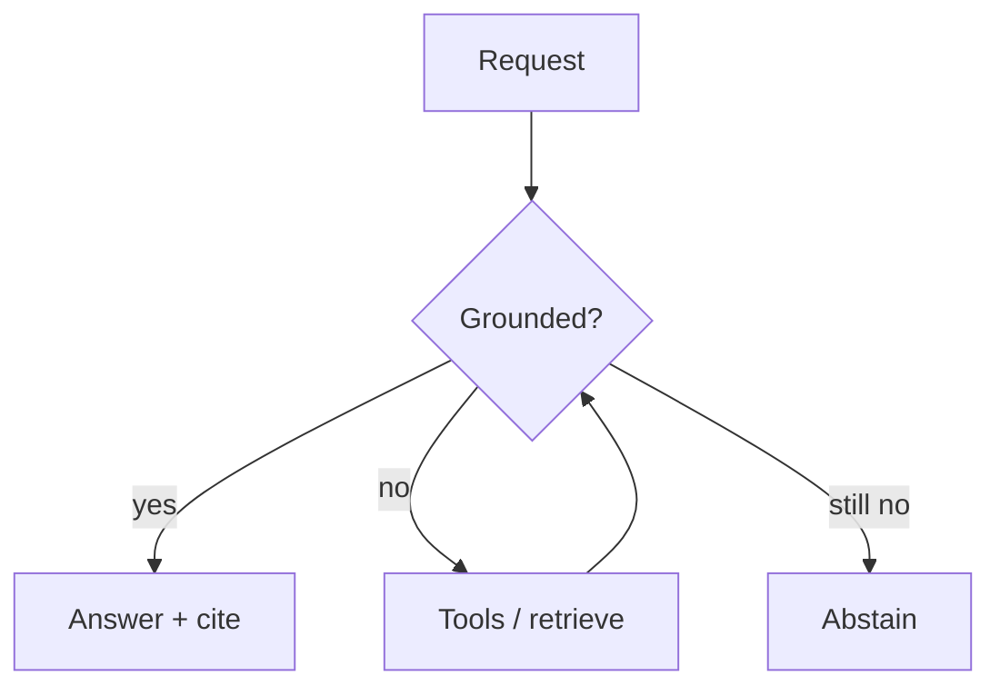

# Safety, limitations, and Spark guardrails

AI systems fail loudly and quietly. This page lists **limits** Spark
is willing to print in public docs.

## Model limits (field)

- **Hallucination** — fluent falsehoods without tools/grounding.
- **Jailbreaks / prompt injection** — untrusted text steers tools.
- **Data exfiltration** via tool calls or verbose logs.
- **Bias & dual-use** — capability ≠ permission.
- **Eval hacking** — optimize the benchmark, miss the job.

Alignment stacks (RLHF/RLAIF) reduce *some* failure modes; they do
not erase them ([alignment survey](https://arxiv.org/abs/2407.16216)).

## Spark-printed guardrails

| Guardrail | Where |
|-----------|--------|
| Never beat Claude | Eval, coder, hive, homepage |
| Never train on RTX PRO 6000 | Factory / coder docs |
| Dry-run first | Learn trail, CI |
| Abstain heads | [ABSTAIN_HEADS.md](ABSTAIN_HEADS.md) |
| LLM decompile ≠ SoT | [llm-decompile](research/LLM_DECOMPILE.md) |
| Recompile ≠ semantics | [DECOMPILE_RE.md](DECOMPILE_RE.md) · arXiv:2609.05370 |
| Eyes vision stub only | [MODEL_ASPECTS.md](MODEL_ASPECTS.md) |

## Practical checklist

1. Prefer **retrieve / expect / tests** over vibes.
2. Keep tools on **allowlists**; default dry.
3. Log tool args; redact secrets.
4. Treat benchmark wins as **hypotheses**.
5. When unsure — **abstain** and ask a human.

Hive home: [KNOWLEDGE.md](KNOWLEDGE.md) · Learn:
[/learn/](/learn/) · Factory: [FACTORY.md](FACTORY.md).
