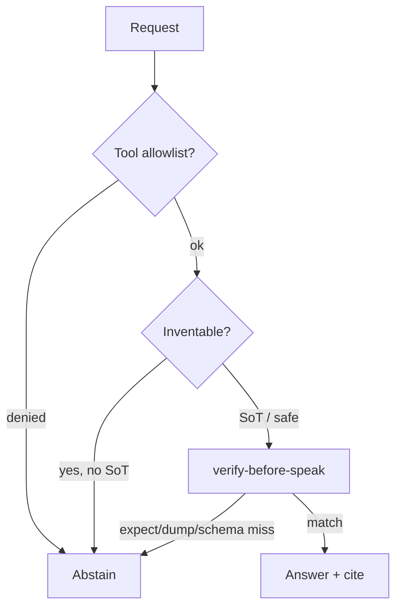
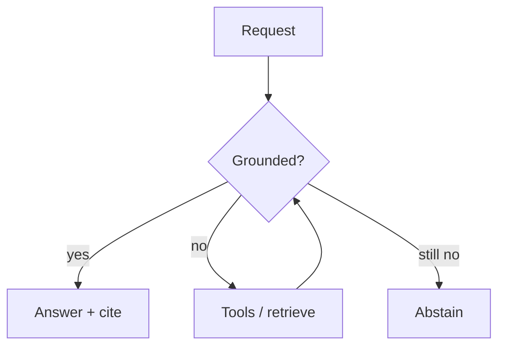

# Safety, limitations, and Spark guardrails

AI systems fail loudly and quietly. This page lists **limits** Spark
is willing to print in public docs.

## Model limits

Field failure modes (not Spark-specific patents).

### Hallucination

Fluent falsehoods without tools or grounding. Prefer retrieve /
expect / tests over vibes.

### Jailbreaks / prompt injection

Untrusted text steers tools. Keep tools on allowlists; default dry.

### Data exfiltration

Tool calls or verbose logs can leak secrets. Log args; redact.

### Bias & dual-use

Capability ≠ permission. Do not treat model output as policy.

### Eval hacking

Optimize the benchmark, miss the job. Treat wins as hypotheses.

Alignment stacks (RLHF/RLAIF) reduce *some* failure modes; they do
not erase them ([alignment survey](https://arxiv.org/abs/2407.16216)).
Spark does **not** claim literal impossibility of all lies. What we
ship is **forced grounding**: guessing should fail CI.

## Guardrails

| Guardrail | Where |
|-----------|--------|
| | Eval, coder, hive, homepage |
| Prefer CPU or consumer GPU for train | Factory / coder docs |
| Dry-run first | Learn trail, CI |
| Abstain heads | [ABSTAIN_HEADS.md](../ABSTAIN_HEADS.md) |
| Grounded generation / anti-guess | This page · `./spark-ground` |
| `ground fact "…" from "…" else abstain` | Language verify-before-speak (voice loop) |
| LLM decompile ≠ SoT | [llm-decompile](../research/LLM_DECOMPILE.md) |
| Recompile ≠ semantics | [DECOMPILE_RE.md](DECOMPILE_RE.md) · arXiv:2609.05370 |
| Eyes vision stub only | [Model aspects](../MODEL_ASPECTS.md) |

## Grounding

### Grounded generation / anti-guess

**Goal:** make it **nearly impossible to pass CI while guessing** —
abstain, retrieve/expect, tool allowlists, verify-before-speak,
structured outputs. Not magic weights.

Language form (synthetic facts only):

```text
ground fact "desk_hours" from "examples/fixtures/voice_loop/facts.json" \
 else abstain
```

Dry-run: `./spark --dry-run examples/ground_fact.spark`.
Gate: `make test-ground-lang`. See [VOICE_AGENT_LOOP.md](VOICE_AGENT_LOOP.md).

### Modify / adapt path (Qwen-class + Spark-owned)

Language already has attach-only modify:

```text
model modify keep_existing "out/train/existing-lora" \
 add "out/train/job-dry-001/adapter.bin" \
 head "out/heads/abstain.pt" -> modified
```

Companion API (manifest only — no Hub download, no PEFT train in
this tool):

```bash
./spark-ground adapter-attach \
 --base qwen \
 --keep-existing out/train/existing-lora \
 --add out/train/job-dry-001/adapter.bin \
 --add out/heads/abstain.pt \
 --out out/ground/adapter_manifest.json
```

- **Spark-owned** bases (TinyCoder / STEP / reply-pack): train on
 CPU or **5090** via existing factory / coder lanes.
- **External bases** (e.g. local Qwen HF dir): reverse/inspect via
 `./spark-model-lab`; attach adapters/heads with
 `keep_special_training`. **Full Qwen SFT** is **opt-in
 large** on **5090** — **never** the reserved voice GPUs. - Owned homepage methods are **not** LoRA theater; see
 [TRAINING.md](TRAINING.md) · [MODEL_LAB.md](../MODEL_LAB.md).

### Functions (forced grounding)

| Function | Role |
|----------|------|
| `expect` | Pass/fail on bound vars / fixtures (`make test-expect`) |
| `retrieve` | RAG hits before answer ([AGENTS_TOOLS.md](AGENTS_TOOLS.md)) |
| `abstain` | SELECT-before-SAMPLE IDK heads ([ABSTAIN_HEADS.md](../ABSTAIN_HEADS.md)) |
| `verify` | `./spark-ground verify` — wrong candidate → abstain |
| `cite` | Cite expect / fixture / dump / retrieve in the payload |
| Dry tools | Allowlisted `tool` stubs; default dry |
| Recompile ≠ semantics | Decompile round-trip is **not** proof of meaning |

### `spark-ground` mode

Refuses to answer unless dump / fixture / expect (or schema) match:

```bash
make spark-ground
# Wrong guess fails CI (exit 2):
./spark-ground ask --prompt "dryer start price right now?" \
 --sot-ok --expect "2.50" --candidate "9.99"
# Match passes:
./spark-ground ask --prompt "dryer start price right now?" \
 --sot-ok --expect "2.50" --candidate "2.50"
# Structured verify (stdlib JSON Schema subset — no xgrammar dep):
./spark-ground verify \
 --candidate '{"price_usd":2.5,"source":"fixture"}' \
 --schema examples/fixtures/ground/want_price.schema.json
make test-ground
```

Flagship dry playbook: `examples/grounded_ask.spark` (with
`examples/no_invent.spark` / inventable verify).

Optional constrained decode via **xgrammar** is **not** required;
Spark verifies JSON against a small schema subset after generate.
Heavier constrained-decode stacks stay opt-in.



## Practical checklist

1. Prefer **retrieve / expect / tests** over vibes.
2. Keep tools on **allowlists**; default dry.
3. Log tool args; redact secrets.
4. Treat benchmark wins as **hypotheses**.
5. When unsure — **abstain** and ask a human.
6. Run **`make test-ground`** before claiming inventable facts are
 safe.



Hive home: [Knowledge](../KNOWLEDGE.md) · Learn:
[/learn/](/learn/) · Factory: [Factory hub](../FACTORY.md) ·
Behaviors: [Model aspects](../MODEL_ASPECTS.md) ·
Voice ask: [VOICE_ASK.md](../VOICE_ASK.md) ·
Coder: [Spark coder](../SPARK_CODER.md).
