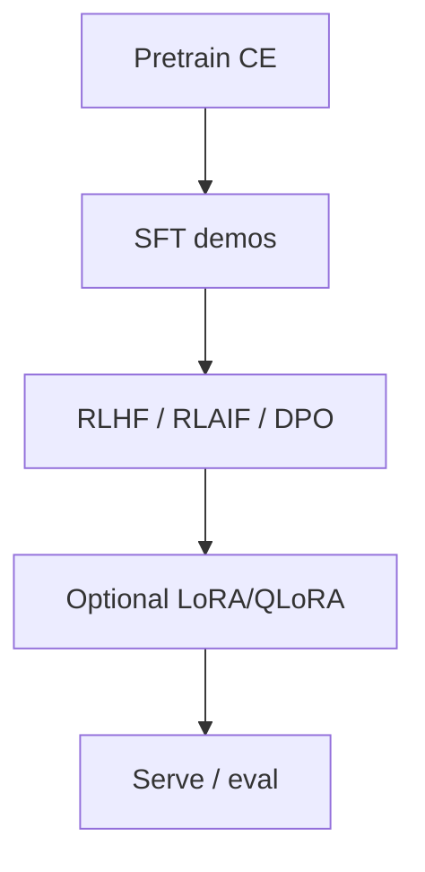

# Training stack — pretrain, SFT, RLHF/RLAIF, LoRA, optimizers

Industry training is a **pipeline**, not one `fit()` call. Spark’s
five CPU reference methods and TinyCoder SGD are a **small parallel
universe** — useful for reviewable `.spark` jobs, not InstructGPT-scale
alignment theater.

## 1. Pretraining

Maximize next-token likelihood on huge corpora (causal language
modeling). Optimizer is usually **Adam / AdamW** (adaptive moments)
or large-batch variants; classic **SGD** with momentum still appears
in teaching stacks and Spark fixtures.

Loss sketch: cross-entropy between predicted vocab distribution and
the true next token.

## 2. Supervised fine-tuning (SFT)

Train on **instruction → demonstration** pairs so the base model
follows task format. Still CE loss — just on curated data.

## 3. Preference alignment

**RLHF** — Reinforcement Learning from Human Feedback
([InstructGPT / Ouyang et al., 2022](https://arxiv.org/abs/2203.02155);
Anthropic HH): humans rank outputs → reward model → policy optimize
(often PPO) with a KL penalty to the SFT policy.

**RLAIF** — same loop with **AI** preference labels / constitutions
([Bai et al., Constitutional AI](https://arxiv.org/abs/2212.08073);
[Lee et al., RLAIF](https://arxiv.org/abs/2309.00267)).

**DPO** and friends skip an explicit RL loop and optimize preferences
directly ([Rafailov et al.](https://arxiv.org/abs/2305.18290)).
Survey:
[LLM alignment techniques](https://arxiv.org/abs/2407.16216).

## 4. LoRA / QLoRA (PEFT)

**LoRA** freezes base weights and trains low-rank adapters
`BA` ([Hu et al., 2021](https://arxiv.org/abs/2106.09685)).

**QLoRA** keeps the base in 4-bit (NF4) while training adapters
([Dettmers et al., 2023](https://arxiv.org/abs/2305.14314)).

Spark homepage honesty: owned methods are **not LoRA theater**. See
[SPARK_CODER.md](SPARK_CODER.md) and [TRAIN_LOOP.md](TRAIN_LOOP.md).

## Spark cross-links

- Outer/inner SGD fixtures — [TRAIN_LOOP.md](TRAIN_LOOP.md)
- Builder TRAIN opcodes — [SPARK_BUILDER.md](SPARK_BUILDER.md)
- Model train HTTP — [MODEL_TRAINING.md](MODEL_TRAINING.md)
- Factory hub — [FACTORY.md](FACTORY.md)

Next: [Inference](INFERENCE.md) · [Eval honesty](EVAL_HONESTY.md).
