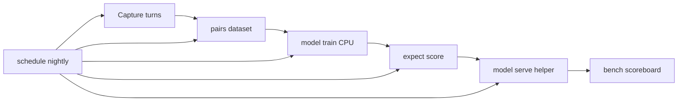

# Voice agent loop

Capture → pairs → train → expect → serve → bench — a **CPU-first**
loop for improving spoken agents with synthetic fixtures. No vendor
or customer names. Dry-run works offline; live helpers are local HTTP.

## Flow



## Language surface

| Statement | Role | Dry / live |
|-----------|------|------------|
| `model pairs from "…" schema "…" …` | Preference/reply inputs | Dry + CPU |
| `expect score replay "…" with helper "…" >= baseline "…"` | Helper ≥ baseline gate | Dry + CPU |
| `model serve helper "…" as "…" port N mode "shadow"|"live"` | Local HTTP ranker | Dry plan; live `spark-serve-ref` |
| `ground fact "…" from "…" else abstain` | Verify-before-speak | Dry + CPU |
| `bench fixtures "…" against "a" "b" …` | Two-agent scoreboard | Dry + CPU |
| `schedule nightly "prog.spark" …` | Nightly summary JSON | Dry + CPU |

Honest adoption: **language + companion** (no new SPARK_BC opcodes).
GAS forks `./spark-voice-loop`. See [LANGUAGE.md](../LANGUAGE.md).

## Synthetic example

```
model pairs from "examples/fixtures/voice_loop/turns.jsonl" \
  schema "context,target_turn,candidate_turn,score_target,score_candidate,class" \
  where class = "stall" min_gap 2 -> ds

expect score replay "examples/fixtures/voice_loop/*.spark" \
  with helper "out/pref-001" >= baseline "out/none"

model serve helper "out/pref-001" as "ranker" port 8091 mode "shadow"

ground fact "desk_hours" from "examples/fixtures/voice_loop/facts.json" \
  else abstain

bench fixtures "examples/fixtures/voice_loop/*.spark" \
  against "agent-a" "agent-b" \
  classes "turn_taking,stall,dead_air,interrupt,filler,handoff,grounded" \
  -> board

schedule nightly "examples/pairs_basic.spark" \
  pairs "examples/fixtures/voice_loop/turns.jsonl" \
  helper "out/pref-001" -> summary
```

Gate: `make test-pairs test-expect-score test-serve-helper \
test-ground-lang test-bench test-schedule`.

## Safety

Ground before speaking numbers, hours, or names — see
[SAFETY_LIMITS.md](SAFETY_LIMITS.md). Shadow serve logs beside a turn;
it does not invent facts.

## Related

- [MODEL_TRAINING.md](../MODEL_TRAINING.md) — `/replay` contract
- [TRAINING.md](TRAINING.md) · [AGENTS_TOOLS.md](AGENTS_TOOLS.md)
